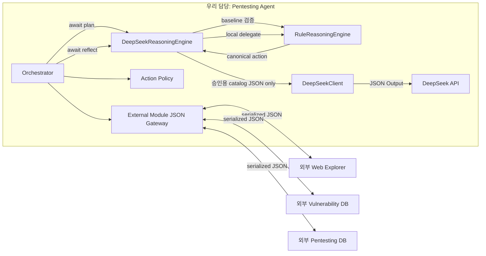

# DeepSeek Reasoning Adapter 구현 계획

## 1. 목적과 범위

이 문서는 Agent 내부의 규칙 기반 추론 교체 지점에 DeepSeek API를 선택적으로 연결하는 구현 계획이다. 외부 Web Explorer, 취약점 DB, 펜테스팅 DB와의 JSON 계약은 변경하지 않는다.

### 구현 범위

- `src/deepseek-client.js`: DeepSeek Chat Completions JSON HTTP client
- `src/deepseek-config.js`: 환경변수 기반 설정 검증과 기본값
- `src/deepseek-reasoning-engine.js`: 모델 선택 결과를 기존 규칙 기반 행동으로 변환하는 어댑터
- Orchestrator의 동기·비동기 Reasoning Engine 호환
- 모델 출력의 엄격한 로컬 schema 검증과 fail-closed 처리
- fake client/fetch 기반 단위·통합 테스트
- 명시적으로 opt-in한 경우에만 실행되는 live contract demo
- `.env.example`, 실행법, 안전 경계 문서화

### 비범위

- Web Explorer, 취약점 DB, 펜테스팅 DB의 구현 또는 transport adapter
- DeepSeek가 직접 HTTP URL, method, query, body를 생성하거나 도구를 실행하는 기능
- DeepSeek를 외부 모듈용 `gateway.exchange()` receiver로 추가하는 변경
- finding 확정, evidence 판정 또는 `reflect` 단계의 LLM 위임
- raw chain-of-thought 저장·출력·재사용
- 기본 테스트 중 실제 API 호출
- 다중 반복, 자율 도구 호출, 자동 공격 범위 확대

## 2. 공식 API 사실과 프로젝트 정책

아래 두 범주를 혼동하지 않는다. “공식 API 사실”은 DeepSeek 문서에서 확인한 현재 인터페이스이고, “프로젝트 정책”은 이 Agent가 추가로 적용하는 제한이다.

### 공식 API 사실 — 2026-10-06 확인

- OpenAI 호환 base URL은 `https://api.deepseek.com`이다.
- Chat Completions endpoint는 `POST /chat/completions`다.
- 현재 문서에 명시된 모델 ID는 `deepseek-flash`와 `deepseek-v4-pro`다.
- 요청 header는 `Authorization: Bearer <API key>`와 `Content-Type: application/json`을 사용한다.
- `response_format: { "type": "json_object" }`로 JSON Output을 요청할 수 있다.
- JSON Output 사용 시 prompt에 `json`이라는 표현과 원하는 JSON 예시를 포함해야 한다.
- JSON Output도 빈 `content`를 반환할 수 있고, `finish_reason: "length"`이면 출력이 잘렸을 수 있으므로 호출자가 검사해야 한다.
- 현재 모델의 thinking mode는 기본 활성화다. 단순한 catalog 선택에는 `thinking: { "type": "disabled" }`를 명시해 raw reasoning 생성과 불필요한 비용을 줄인다.

공식 근거:

- [Models & Pricing](https://api-docs.deepseek.com/quick_start/pricing/)
- [Chat Completions API](https://api-docs.deepseek.com/api/create-chat-completion/)
- [JSON Output](https://api-docs.deepseek.com/guides/json_mode/)
- [Thinking Mode](https://api-docs.deepseek.com/guides/thinking_mode/)
- [Rate Limit & Isolation](https://api-docs.deepseek.com/quick_start/rate_limit/)
- [Change Log](https://api-docs.deepseek.com/updates/)

### 프로젝트 자체 정책

- 모델은 실행 가능한 action을 만들지 않고, Agent가 만든 `candidateId`와 `actionCatalogId`만 선택한다.
- 프로젝트 기본 모델은 `deepseek-flash`로 둔다. `deepseek-v4-pro` 사용은 호출자가 명시적으로 설정한다.
- 모델 선택은 권한 부여가 아니다. 기존 `RuleReasoningEngine`이 canonical action을 만들고 `ActionPolicy`가 실행 직전에 최종 승인한다.
- 모델의 정상 `stop` 결정만 정규화된 stop plan으로 반환한다. API·transport·출력 schema 실패는 오류를 throw하고 Orchestrator의 실패 보고 경로에서 action 전에 종료한다.
- `reflect`와 finding 확정은 항상 결정론적 로컬 코드에서 수행한다.
- DeepSeek는 내부 provider이므로 외부 모듈 envelope의 `MODULE_NAMES`에 추가하지 않는다.
- API key, Authorization header, 전체 prompt, 원문 모델 응답, `reasoning_content`는 event나 최종 report에 기록하지 않는다.
- 모델 HTTP 호출의 기본 retry 횟수는 1이고 설정 범위는 0~2다. retry는 action 실행 전의 retryable DeepSeek 오류에만 적용하며, Web Explorer의 변경 행동은 절대 자동 재시도하지 않는다.

## 3. 목표 구조



실행 경계는 다음 순서다.

1. Orchestrator가 외부 취약점 DB의 검증된 후보와 관찰한 canary target을 받는다.
2. `DeepSeekReasoningEngine`이 먼저 `RuleReasoningEngine.plan()`을 호출해 후보와 실제 target을 검증하고 method/path/query를 포함한 canonical baseline action을 만든다. 로컬 규칙이 stop이면 API를 호출하지 않는다.
3. baseline이 act일 때만 외부 `knowledgeId`와 분리된 내부 ID `candidate-0` 및 고정 `actionCatalogId`를 붙인 bounded prompt view를 만든다.
4. DeepSeek는 제공된 candidate/catalog ID를 승인하거나 중단만 JSON으로 선택한다.
5. 어댑터가 응답의 정확한 필드와 ID를 검증한다. 정상 stop이면 stop plan을 반환하고, 정상 act이면 이미 검증된 local baseline action을 반환한다. 잘못된 schema나 ID는 `DEEPSEEK_SCHEMA_ERROR`를 throw한다.
6. Orchestrator의 기존 `ActionPolicy`가 관찰된 canary, 세션, origin, method, path, query, body와 요청 예산을 다시 검사한다.
7. 검증 후에만 외부 Web Explorer에 JSON 요청을 보낸다.
8. `reflect()`는 DeepSeek를 호출하지 않고 기존 `RuleReasoningEngine.reflect()`에 위임한다.

## 4. 설정과 `.env`

`src/deepseek-config.js`는 import 시 파일을 읽거나 네트워크를 호출하지 않는다. 호출자가 `resolveDeepSeekOptions()` 또는 `createDeepSeekReasoningEngineFromEnv()`를 명시적으로 호출할 때 기본 `agent/.env`를 선택적으로 읽고, 전달받은 `env` 객체(기본값 `process.env`)의 같은 이름 값을 우선 적용한다. 결과는 검증된 불변 설정 객체다. `envFile: false`로 파일 읽기를 끌 수 있고, 테스트에서는 `env`, `envFile`, `readFileSync`를 주입해 격리한다.

| 변수 | 필수 여부 | 기본값 | 규칙 |
|---|---:|---|---|
| `DEEPSEEK_API_KEY` | DeepSeek 사용 시 필수 | 없음 | trim 후 비어 있거나 공백·제어 문자를 포함하면 설정 오류 |
| `DEEPSEEK_BASE_URL` | 선택 | `https://api.deepseek.com` | 공식 DeepSeek HTTPS host 또는 명시적 loopback HTTP만 허용; credential·query·fragment 금지 |
| `DEEPSEEK_MODEL` | 선택 | `deepseek-flash` | 우선 `deepseek-flash`, `deepseek-v4-pro`만 허용 |
| `DEEPSEEK_TIMEOUT_MS` | 선택 | `60000` | 1~600000ms 정수 |
| `DEEPSEEK_MAX_RETRIES` | 선택 | `1` | 0~2 정수; 최초 요청 이후의 추가 시도 횟수 |
| `DEEPSEEK_MAX_TOKENS` | 선택 | `512` | 64~8192 정수 |

로컬 `agent/.env`는 계속 Git에서 제외한다. 저장소에는 다음과 같이 값이 비어 있는 `agent/.env.example`만 추적한다.

```dotenv
DEEPSEEK_API_KEY=
DEEPSEEK_BASE_URL=https://api.deepseek.com
DEEPSEEK_MODEL=deepseek-flash
DEEPSEEK_TIMEOUT_MS=60000
DEEPSEEK_MAX_RETRIES=1
DEEPSEEK_MAX_TOKENS=512
```

`.env` 파일 로딩은 core module import의 부작용으로 수행하지 않는다. 명시적 factory/config 호출에서만 기본 파일을 읽으며 `process.env`가 파일 값보다 우선한다. 오류 객체, console 출력, test snapshot에는 API key를 포함하지 않는다.

## 5. `deepseek-client.js`

### 생성자와 주입

`DeepSeekClient`는 다음 값을 생성자에서 받는다.

- 검증된 `apiKey`, `baseUrl`, `model`, `timeoutMs`, `maxTokens`, `maxRetries`
- 테스트를 위한 `fetchImpl` 주입점(기본값 `globalThis.fetch`)
- retry backoff 테스트를 위한 `sleep` 주입점

API key는 외부로 다시 반환하지 않으며, 가능하면 private field에 보관한다.

### 요청

초기 구현은 non-streaming Chat Completions만 사용한다.

```json
{
  "model": "deepseek-flash",
  "messages": [
    { "role": "system", "content": "...json schema and untrusted-data rule..." },
    { "role": "user", "content": "{...candidate catalog JSON...}" }
  ],
  "response_format": { "type": "json_object" },
  "thinking": { "type": "disabled" },
  "max_tokens": 512,
  "stream": false
}
```

요청에는 API key, target cookie, Authorization header, raw evidence 본문을 prompt data로 넣지 않는다. system prompt와 직렬화된 user payload의 합은 64KiB 이하로 제한한다.

### 응답 검증

HTTP 2xx만 성공으로 처리하고, 성공 본문도 다음을 모두 만족해야 한다.

- JSON object이며 `choices`가 정확히 하나 존재
- `finish_reason === "stop"`
- `message.content`가 비어 있지 않은 문자열
- 전체 HTTP response는 512KiB 이하, `message.content`는 64KiB 이하
- content가 JSON object로 parse 가능
- 후속 domain schema 검증 통과

`reasoning_content`와 provider request ID는 응답에 있더라도 읽거나 저장하지 않는다. 설정에서 검증된 모델명, 고정 provider, 검증된 finish reason과 정수 token usage만 정규화해 반환한다.

### timeout과 retry

- 각 호출은 전용 `AbortController`와 deadline을 사용한다.
- timeout 후에는 요청을 abort하고 `DEEPSEEK_TIMEOUT`으로 정규화한다.
- 기본값 `maxRetries=1`은 최초 요청과 최대 한 번의 추가 시도를 허용한다. 설정값은 0~2로 제한한다.
- action 실행 전 DeepSeek 요청 중 빈 content, 429, 500, 503, timeout, transport 실패를 retry한다. `finish_reason === "insufficient_system_resource"`도 retryable incomplete 응답으로 분류한다.
- retry 사이에는 짧고 제한된 exponential backoff를 적용한다.
- 400, 401, 402, 403, 422, 일반 schema/JSON 오류, `length`나 `content_filter`로 끝난 응답은 retry하지 않는다.
- non-2xx 응답은 오류를 반환하거나 재시도하기 전에 response body와 controller를 취소해 연결을 남기지 않는다.
- API retry 여부와 무관하게 DELETE 등 Web Explorer 변경 행동은 재시도하지 않는다.

### 오류 taxonomy

| 코드 | 의미 | retry 가능성 | 외부 보고 내용 |
|---|---|---:|---|
| `DEEPSEEK_CONFIG_ERROR` | 키·URL·모델·숫자 설정 오류 | 아니오 | 비밀 없는 고정 메시지 |
| `DEEPSEEK_AUTH_ERROR` | HTTP 401/403 | 아니오 | 인증 실패 분류와 status |
| `DEEPSEEK_BALANCE_ERROR` | HTTP 402 | 아니오 | 잔액 실패 분류와 status |
| `DEEPSEEK_RATE_LIMITED` | HTTP 429 | 예 | rate-limit 분류와 status |
| `DEEPSEEK_REQUEST_ERROR` | HTTP 400/422 | 아니오 | 요청 형식 실패 분류와 status |
| `DEEPSEEK_UPSTREAM_ERROR` | HTTP 500/503 | 예 | upstream 실패 분류와 status |
| `DEEPSEEK_HTTP_ERROR` | 그 밖의 non-2xx | 아니오 | status만 기록 |
| `DEEPSEEK_RESPONSE_ERROR` | 잘못된 HTTP/API envelope, 읽기·크기·parse 오류 | 아니오 | 고정 검증 메시지 |
| `DEEPSEEK_INCOMPLETE_RESPONSE` | `finish_reason !== "stop"` | `insufficient_system_resource`만 예 | 원문 content 없이 분류 |
| `DEEPSEEK_EMPTY_RESPONSE` | 비어 있는 `message.content` | 예 | 원문 없이 분류 |
| `DEEPSEEK_OUTPUT_ERROR` | content 크기 초과·JSON parse·object 형식 오류 | 아니오 | 고정 검증 메시지 |
| `DEEPSEEK_TRANSPORT_ERROR` | DNS/TLS/fetch 실패 | 예 | 원문 body 없이 분류만 기록 |
| `DEEPSEEK_TIMEOUT` | deadline 초과 | 예 | 고정 timeout 메시지 |
| `DEEPSEEK_ABORTED` | 호출자 signal 중단 | 아니오 | 중단 분류만 기록 |
| `DEEPSEEK_SCHEMA_ERROR` | reasoning domain schema 또는 허용 ID 오류 | 아니오 | 비밀 없는 검증 메시지 |

DeepSeek가 반환한 오류 body나 모델 content를 예외 메시지에 그대로 연결하지 않는다.

## 6. `deepseek-reasoning-engine.js`

### 모델 출력 schema

모델이 반환할 수 있는 정보는 실행 불가능한 ID 선택뿐이다.

```json
{
  "state": "act",
  "candidateId": "candidate-0",
  "actionCatalogId": "delete_observed_canary"
}
```

로컬 validator는 정확히 `state`, `candidateId`, `actionCatalogId` 세 필드만 허용한다. 즉 `additionalProperties: false`에 해당하는 엄격 검사를 수행한다.

- `state`는 `act` 또는 `stop`만 허용한다.
- `act`일 때 `candidateId`는 Agent가 만든 내부 ID `candidate-0`, `actionCatalogId`는 `delete_observed_canary`와 일치해야 한다.
- `stop`일 때 `candidateId`, `actionCatalogId`는 모두 `null`이어야 한다.
- `candidateId`는 최대 200자, `actionCatalogId`는 최대 100자로 제한한다.
- `action`, `url`, `path`, `method`, `query`, `body`, tool call 또는 알 수 없는 필드가 있으면 전체 출력을 거부한다.

JSON Output은 유효한 JSON 생성을 돕지만 프로젝트 domain schema 적합성을 보장하지 않으므로 반드시 로컬에서 다시 검증한다.

### hybrid safety boundary

`plan(input)`은 다음 방식으로 동작한다.

1. 기존 `RuleReasoningEngine.plan(input)`을 먼저 실행한다.
2. 규칙 엔진이 후보 개수, 실제 `expectedTarget`의 resource/owner/attacker, 허용 method와 path template를 검사하고 canonical baseline action을 만든다.
3. local plan이 stop이면 DeepSeek를 호출하지 않고 그대로 반환한다.
4. local plan이 act일 때만 외부 `knowledgeId`를 prompt에서 제외하고 Agent가 만든 `candidate-0`을 사용한 bounded catalog view를 DeepSeek client에 보낸다.
5. 모델 출력 schema와 선택 ID를 검증한다.
6. 정상 `stop`이면 `{ state: "stop", action: null, ... }`의 정규화 결과를 반환한다.
7. 정상 `act`이면 모델이 선택한 ID가 허용된 한 후보와 catalog에 정확히 일치하는지 확인하고, 새 action을 만들지 않은 채 2단계의 canonical local plan을 반환한다.

DeepSeek 호출 전에 local baseline을 계산하지만 이는 검증용이며 즉시 실행되지 않는다. DeepSeek client 오류는 해당 `DEEPSEEK_*` 오류로, 모델 domain schema나 허용 ID 오류는 `DEEPSEEK_SCHEMA_ERROR`로 throw한다. Orchestrator가 실패 report를 finalize하며 `actionAttempted`는 `false`로 남는다. 오류 시 미리 계산한 baseline action으로 fallback하지 않으므로 모델 장애가 공격 행동으로 승격되지 않는다. 오직 유효한 모델의 `state: "stop"`만 일반 stop plan으로 반환한다.

`reflect(input)`은 네트워크를 사용하지 않고 `RuleReasoningEngine.reflect(input)`를 그대로 호출한다. finding status와 confidence는 전·후 상태 및 구조화 evidence에 의해서만 결정된다.

## 7. Orchestrator 비동기 계약

`runOnce()`는 `reasoningEngine.plan()`과 `reflect()`를 다음처럼 await해 동기 규칙 엔진과 비동기 DeepSeek 어댑터를 모두 지원한다.

```js
const plan = await reasoningEngine.plan(planInput);
const reflection = await reasoningEngine.reflect(reflectionInput);
```

JavaScript의 `await`는 일반 객체도 그대로 통과시키므로 기존 동기 `RuleReasoningEngine`과 하위 호환된다. Reasoning Engine 계약은 다음처럼 문서화한다.

```text
plan(input)    -> Plan | Promise<Plan>
reflect(input) -> Reflection | Promise<Reflection>
```

await와 출력 검증은 event 저장 전에 완료해야 한다. Promise 객체나 검증 전 모델 원문을 펜테스팅 DB event에 기록하지 않는다. `plan.state !== "act"`이면 기존 failure/finalize 경로를 사용하되 `actionAttempted`는 `false`로 남아야 한다.

## 8. 로그와 telemetry

저장 가능 항목:

- provider 이름 `deepseek`
- 로컬 설정에서 검증된 모델 ID
- 로컬에서 검증한 `finishReason: stop`
- prompt/completion/total token 수
- 로컬 규칙 엔진의 결정 또는 실패 report의 오류 taxonomy 코드

저장 금지 항목:

- `DEEPSEEK_API_KEY`, Authorization header
- cookie, session credential
- 전체 system/user prompt
- 원문 `message.content`
- `reasoning_content` 또는 raw chain-of-thought
- API 오류 원문 body
- provider request ID와 provider가 주장한 임의 모델 문자열

모델이 반환한 자유 텍스트는 허용하지 않는다. 승인 시 기존 local plan의 결정 요약과 가설을 유지하고, 중단 시 Agent가 만든 고정 요약만 저장한다.

## 9. 공개 API와 기존 계약 영향

`src/index.js`에는 다음 공개 항목을 추가한다.

- `DeepSeekClient`
- `DeepSeekError`
- `DeepSeekReasoningEngine`
- `createDeepSeekReasoningEngineFromEnv`
- `resolveDeepSeekOptions`
- `ACTION_CATALOG_ID`

기존 `ActionPolicy`, `RuleReasoningEngine`, `runOnce`, protocol export는 유지한다. `protocol.js`의 외부 module name, message type, envelope 계약은 변경하지 않는다. `DeepSeekClient`만 DeepSeek HTTP를 알고 Orchestrator와 외부 module gateway는 이를 알지 못한다.

## 10. 테스트 계획

기본 `npm test`는 네트워크와 API key 없이 전부 실행되어야 한다.

| 계층 | 테스트 | 기대 결과 |
|---|---|---|
| Config | 기본 `agent/.env`와 process env 우선순위 | env가 파일 값을 덮어쓴 불변 설정 생성 |
| Config | 빈 키, 외부 HTTP URL, credential URL, 잘못된 숫자·모델 | `DEEPSEEK_CONFIG_ERROR` |
| Config | 공식 HTTPS 또는 loopback HTTP URL | 허용하고 정규화 |
| Client | fake fetch 200 + valid JSON Output | 정규화된 content/usage 반환 |
| Client | 401/403, 402, 400/422 | 각각 AUTH, BALANCE, REQUEST 오류이며 retry 없음 |
| Client | 429, 500, 503 | 각각 RATE_LIMITED, UPSTREAM 오류이며 기본 1회 retry |
| Client | reject/DNS/TLS 대역 | `DEEPSEEK_TRANSPORT_ERROR` |
| Client | 응답 지연 | abort 후 `DEEPSEEK_TIMEOUT` |
| Client | malformed API JSON, 빈 choices | `DEEPSEEK_RESPONSE_ERROR` |
| Client | 빈 content | retry 상한 후 `DEEPSEEK_EMPTY_RESPONSE` |
| Client | prompt/response/content 크기 경계 | 각각 64KiB/512KiB/64KiB 상한 준수 |
| Client | `finish_reason: length/content_filter` | `DEEPSEEK_INCOMPLETE_RESPONSE`, retry 없음 |
| Adapter | valid candidate/catalog 선택 | 먼저 만든 Rule baseline canonical DELETE 승인 |
| Adapter | `stop` 선택 | `action: null`, API 외부 행동 없음 |
| Adapter | local Rule baseline stop | DeepSeek 호출 없이 stop |
| Adapter | unknown candidate/catalog ID | `DEEPSEEK_SCHEMA_ERROR`, DELETE 0회 |
| Adapter | 누락·추가 필드, 잘못된 null/ID 형식 | `DEEPSEEK_SCHEMA_ERROR`, DELETE 0회 |
| Adapter | extra `action`, URL, method, body 필드 | `DEEPSEEK_SCHEMA_ERROR`, DELETE 0회 |
| Adapter | client/output 오류 | 오류 throw, 미리 만든 Rule baseline으로 fallback하지 않음 |
| Adapter | malicious candidate text/prompt injection | catalog 밖 action 생성 불가 |
| Adapter | `reflect` | client 추가 호출 없이 기존 finding 판정 |
| Orchestrator | async fake `plan`/`reflect` | await 후 기존 한 번 루프 완료 |
| Orchestrator | DeepSeek stop 또는 schema error | DELETE 0회, `actionAttempted: false`, 실패 report finalize와 오류 code 보존 |
| Regression | 기본 engine 생략 | 기존 `RuleReasoningEngine` 결과와 14개 테스트 유지 |
| Boundary | production source inventory | 외부 모듈 구현은 계속 없음 |
| Boundary | HTTP 사용 위치 | `fetch`는 `deepseek-client.js`에만 허용 |
| Secret | logs/errors/events 검사 | key, Authorization, raw response, CoT 미포함 |

production-boundary 테스트는 production 파일 목록에 새 파일 세 개를 명시하고 core 파일의 직접 `fetch`와 `node:fs`를 계속 금지한다. `fetch`는 `deepseek-client.js`, `.env`의 선택적 읽기는 `deepseek-config.js`에만 둔다. 모든 production 파일의 `node:http`, `node:https`, `node:net`, `node:tls`, child process와 외부 모듈 구현 금지는 유지한다.

Windows와 Node 18에서도 동일하게 동작하도록 테스트 script는 세 테스트 파일을 명시적으로 `node --test`에 전달한다.

## 11. Opt-in live contract demo

`npm run demo:deepseek` 명령 자체가 opt-in이며 별도 live flag는 사용하지 않는다. 이 demo는 외부 모듈에는 scripted JSON gateway를 사용하면서 Reasoning Engine의 `plan()` 한 번만 실제 DeepSeek API에 연결한다.

- 기본 `npm test`와 `npm run demo`에서는 실행하지 않는다.
- 명령 실행 시 명시적 factory가 기본 `agent/.env`와 process env를 읽는다. 유효한 `DEEPSEEK_API_KEY`가 없으면 `DEEPSEEK_CONFIG_ERROR`로 실패한다.
- 실제 DeepSeek 요청은 설정된 retry 정책 때문에 하나의 plan 호출 안에서 재시도될 수 있고 비용이 발생할 수 있다.
- Web Explorer, 취약점 DB, 펜테스팅 DB는 scripted test double이며 실제 외부 모듈이나 실제 target을 호출하지 않는다.
- scripted gateway 안에서는 setup, observe, knowledge, canonical DELETE, verify, storage의 단일 계약 루프를 수행한다. DELETE는 인메모리 test double에만 전달된다.
- prompt, 응답 원문, API key, Authorization header, CoT는 출력하지 않는다. 정규화된 report, artifacts와 요청 수만 출력한다.
- CI 기본 job에서는 실행하지 않으며, 실제 key와 비용을 승인한 별도 실행에서만 사용한다.

실행 명령은 다음과 같다.

```powershell
cd .\agent
npm run demo:deepseek
```

## 12. 단계적 rollout과 rollback

### 단계 A — offline 구현

- 세 production 파일과 async Orchestrator 계약 구현
- fake fetch/client 테스트 추가
- 기존 Rule engine을 `runOnce()` 기본값으로 유지
- 문서와 `.env.example` 추가

### 단계 B — 개발자 opt-in live contract demo

- `npm run demo:deepseek`로 로컬 live contract demo 실행
- empty content, timeout, 401/429/5xx의 sanitized 실패 확인
- 설정 모델, finish reason, token metadata 형식 확인

### 단계 C — 제한된 Agent opt-in

- 호출자가 `createDeepSeekReasoningEngineFromEnv()`로 생성한 engine을 `reasoningEngine`에 명시한 실행만 활성화
- 단일 canary와 단일 반복 제약 유지
- DeepSeek의 정상 stop 또는 throw 오류로 종료된 실행의 DELETE 0회 여부 감시

### rollback

- 호출자의 DeepSeek engine 주입을 제거하면 즉시 기존 `RuleReasoningEngine` 기본 경로로 돌아간다.
- 모델 실패 중 자동 fallback은 금지하므로, 동일 실행 도중 정책이 바뀌거나 action이 새로 발생하지 않는다.
- 외부 module JSON 계약과 저장된 report schema는 adapter 활성화 여부와 무관하게 유지한다.

## 13. 완료 기준

- `deepseek-client.js`, `deepseek-config.js`, `deepseek-reasoning-engine.js`가 각각 HTTP, config, reasoning 책임만 가진다.
- 기본 모델은 현재 공식 ID인 `deepseek-flash`이고 지원 모델·endpoint가 문서화된다.
- DeepSeek 사용은 명시적 opt-in이며 기본 `runOnce()`는 기존 규칙 기반 동작을 유지한다.
- `plan()`과 `reflect()`의 sync/async 구현이 모두 동작한다.
- 모델은 candidate/catalog ID만 선택하고 실행 가능한 action 필드를 반환할 수 없다.
- canonical action은 `RuleReasoningEngine`만 생성하고 `ActionPolicy`가 최종 실행 권한을 가진다.
- DeepSeek 오류, timeout, 빈 출력, 절단, 잘못된 schema, 알 수 없는 ID가 모두 DELETE 0회로 종료된다.
- `reflect`와 finding 확정은 로컬 결정론적 코드에 남는다.
- 기본 테스트가 실제 네트워크를 사용하지 않고 기존 회귀 테스트를 모두 통과한다.
- `npm run demo:deepseek` 명령 자체가 live opt-in이며, 외부 모듈은 scripted gateway이고 실제 target은 호출하지 않는다.
- API key, Authorization header, raw prompt/response, chain-of-thought가 코드 저장소·로그·event·report에 남지 않는다.
