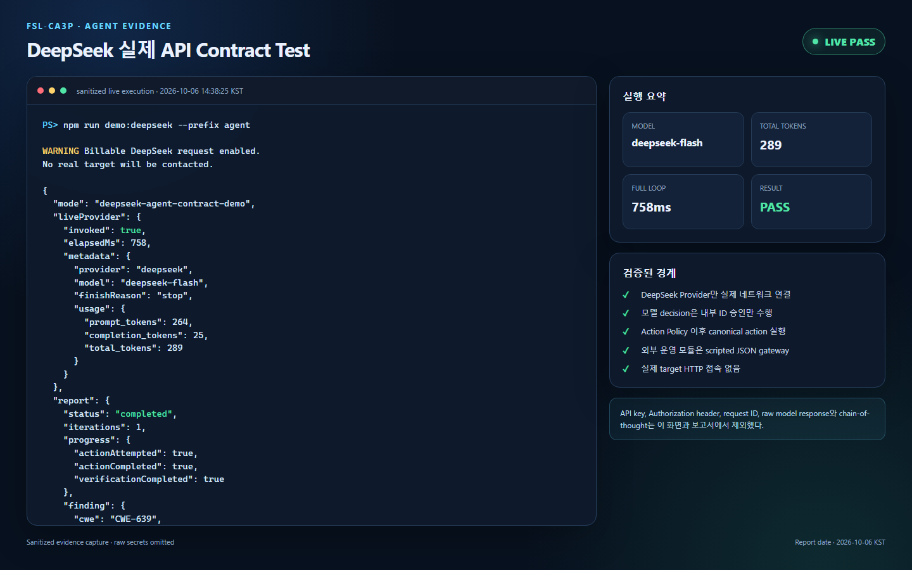
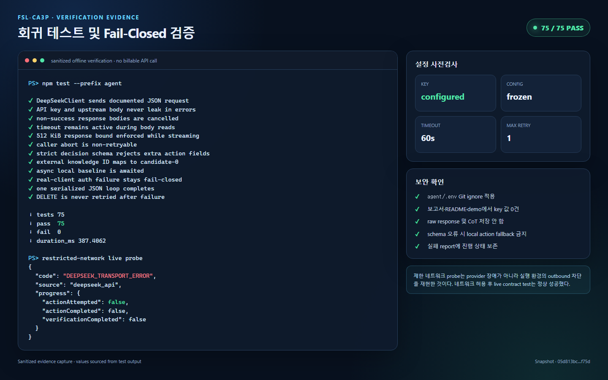

# DeepSeek 실제 API 통합 테스트 보고서

## 1. 결론

**최종 판정: PASS**

2026-10-06 14:38:25 KST에 실제 DeepSeek API를 Reasoning Provider로 연결한 단일 contract loop가 성공했다. API는 유효한 ID 승인 JSON을 반환했고, Agent는 기존 local canonical action과 Action Policy를 거쳐 scripted gateway의 인메모리 fixture 상태에 한 번의 행동·검증·반영 루프를 완료했다.

- 실제 DeepSeek Provider 호출: 성공
- 모델: `deepseek-flash`
- API completion 종료: `finishReason=stop`(정상 완료)
- 모델 decision: `state=act`로 내부 candidate/action catalog 승인
- 성공 응답 token usage: prompt 264, completion 25, total 289
- 전체 contract demo 경과시간: 758ms
- Agent report: `completed`, `iterations=1`
- 실제 공격 대상 및 실제 외부 운영 모듈 호출: 없음
- API key, Authorization header, provider request ID, raw response, chain-of-thought 기록: 없음

## 2. 테스트 범위와 경계

실제 연결 범위는 다음 한 경로다.

```text
DeepSeekClient -> https://api.deepseek.com/chat/completions
```

다음 구성요소는 실제 서비스가 아니라 `createScriptedGateway()`가 제공하는 메모리 기반 test double이다.

- Web Explorer
- Vulnerability DB
- Pentesting DB
- `targetOrigin=http://127.0.0.1:3000`은 scope/policy 입력으로만 사용했으며 실제 서버나 HTTP 접속은 없음

따라서 이번 테스트가 검증하는 것은 Agent 내부 DeepSeek 어댑터, JSON 계약, canonical action 보존, Action Policy 및 단일 reasoning loop다. 실제 사이트 공격 성공, 실제 외부 모듈 호환성, 운영 E2E, 부하와 장기 가용성은 검증 범위가 아니다.

## 3. 실행 환경

| 항목 | 값 |
|---|---|
| 실행 일시 | 2026-10-06 14:38:25 KST |
| 브랜치 | `develop` |
| 기준 HEAD | `67d0f7c` + 미커밋 Agent 변경사항 |
| 테스트 코드 snapshot | SHA-256 `05d813bca906dea4f68c25d2cd3fb1f9ae45d78ff30c086546b49c310861f75d` |
| Snapshot 범위 | `agent/src`, `agent/test`, `agent/test-support`, `agent/package.json`, `agent/.env.example`의 Git tracked/untracked non-ignored 16개 파일; `agent/.env` 제외 |
| OS / Architecture | Windows `win32` / `x64` |
| Node.js | `v24.14.0` |
| API host | `https://api.deepseek.com` |
| 모델 | `deepseek-flash` |
| Timeout | 60000ms |
| 추가 retry 상한 | 1회 |
| `max_tokens` | 512 |
| API key | configured: `true`; 값·길이·prefix 비기록 |

Snapshot digest는 정렬된 저장소 상대 경로, NUL, 파일 원문 bytes, NUL을 파일별로 이어 붙여 SHA-256으로 계산했다.

`agent/.env`는 `agent/.gitignore`의 `.env` 규칙으로 Git에서 제외된 상태를 확인했다.

## 4. 절차와 합격 기준

### 절차

1. 비밀을 출력하지 않고 `.env` 설정의 유효성만 확인했다.
2. `npm test --prefix agent`로 오프라인 회귀 테스트를 실행했다.
3. 제한된 네트워크 환경에서 live demo의 fail-closed 동작을 확인했다.
4. 실제 외부 네트워크가 허용된 환경에서 `npm run demo:deepseek --prefix agent`를 실행했다.
5. 종료 코드, 정규화된 provider metadata, Agent report, 안전 플래그와 `.env` 제외 상태를 검증했다.

### 합격 기준

- 프로세스 exit code 0
- `mode=deepseek-agent-contract-demo`
- `liveProvider.invoked=true`
- provider/model/finish reason/token usage가 정규화되어 존재
- `report.status=completed`, `iterations=1`
- 행동·검증이 각각 정확히 완료
- API key, Authorization, request ID, raw model content와 reasoning content가 출력되지 않음
- 외부 모듈은 scripted 상태를 유지하고 실제 target에 접촉하지 않음

## 5. 결과

| 검사 | 관측값 | 판정 |
|---|---|---:|
| 설정 사전검사 | key configured, 공식 HTTPS host, frozen config | PASS |
| Agent 오프라인 회귀 | 75/75 통과 | PASS |
| 제한 네트워크 fail-closed | `DEEPSEEK_TRANSPORT_ERROR`, `actionAttempted=false` | PASS |
| 실제 DeepSeek 응답 | provider `deepseek`, model `deepseek-flash`, API finishReason `stop` | PASS |
| 모델 decision | strict JSON `state=act`, 내부 candidate/action catalog 승인 | PASS |
| Token usage | 264 prompt + 25 completion = 289 total | PASS |
| Agent 단일 loop | `completed`, 1 iteration | PASS |
| 행동 진행 상태 | attempted/completed/verification 모두 `true` | PASS |
| Scripted finding | CWE-639, `confirmed`, confidence `high` | PASS |
| 요청 예산 | Web 요청 6/8 | PASS |
| JSON gateway 계약 | scripted external request count 17 | PASS |
| 비밀정보 및 raw output 제외 | 민감 필드 미출력 | PASS |

초기 실행은 실행 환경의 outbound network 제한으로 `DEEPSEEK_TRANSPORT_ERROR`가 발생했다. 이때 Agent는 DELETE 성격의 행동을 시도하지 않았고 `actionAttempted=false`인 실패 report를 생성했다. 네트워크를 명시적으로 허용한 다음 실행은 exit code 0으로 성공했다.

### 실행 화면 1 — 실제 DeepSeek API 성공



API key, Authorization header, provider request ID, raw response와 chain-of-thought를 제외한 성공 stdout 허용 필드만 로컬 HTML로 렌더링한 1440×900 화면 캡처다.

PNG SHA-256: `D6C3604A740409ED118AD68376445AF7C8B13397799A4911C17317BC556E8273`

### 실행 화면 2 — 오프라인 회귀 및 fail-closed



75/75 회귀 결과와 제한 네트워크에서 `actionAttempted=false`로 종료된 fail-closed 결과를 함께 표시한 화면 캡처다. 실제 DeepSeek 호출은 첫 번째 화면의 성공 실행에서만 증명한다.

PNG SHA-256: `E3C5D9E1C64AB98AEF7C959898904D8D61BA95F1DCB852DE49DBE481262B5EFE`

두 화면은 저장된 allowlist 결과로 재구성한 sanitized evidence이며 원본 터미널이나 DeepSeek 콘솔 캡처가 아니다. 캡처 생성 과정에서는 DeepSeek API를 재호출하지 않았다. 재현 가능한 로컬 렌더링 원본은 [`test-evidence/deepseek-live-api-evidence-2026-10-06.html`](./test-evidence/deepseek-live-api-evidence-2026-10-06.html)이다.

## 6. 정규화된 실행 증거

아래는 성공 실행 결과에서 allowlist 필드만 옮긴 것이다.

```json
{
  "mode": "deepseek-agent-contract-demo",
  "liveProvider": {
    "invoked": true,
    "elapsedMs": 758,
    "metadata": {
      "provider": "deepseek",
      "model": "deepseek-flash",
      "finishReason": "stop",
      "usage": {
        "prompt_tokens": 264,
        "completion_tokens": 25,
        "total_tokens": 289
      }
    }
  },
  "report": {
    "runId": "run-1791265105117-b661ddbc",
    "status": "completed",
    "iterations": 1,
    "progress": {
      "iterationStarted": 1,
      "actionAttempted": true,
      "actionCompleted": true,
      "verificationCompleted": true
    },
    "finding": {
      "cwe": "CWE-639",
      "status": "confirmed",
      "confidence": "high"
    },
    "metrics": {
      "requestCount": 6,
      "maxRequests": 8
    },
    "safety": {
      "externalJsonOnly": true,
      "externalModulesImplementedByAgent": false,
      "agentHandlesCookies": false,
      "rawChainOfThoughtStored": false
    }
  },
  "externalRequestCount": 17
}
```

## 7. 보안 및 비용 확인

- API key는 로컬 `agent/.env`에서만 읽었으며 출력하거나 저장소에 추가하지 않았다.
- Authorization header, raw upstream body, provider request ID와 chain-of-thought는 stdout, 오류 객체, Agent event와 이 보고서에 포함하지 않았다.
- DeepSeek prompt에는 scripted fixture의 제한된 candidate view만 전달했다. API key, target cookie, 실제 사이트 데이터는 포함하지 않았다.
- 모델은 실행 가능한 URL, method, query 또는 body를 만들지 않았다. `candidate-0`과 고정 action catalog ID의 승인 여부만 반환했다.
- 성공 응답은 총 289토큰을 보고했다. 실제 청구 금액은 DeepSeek billing 내역을 기준으로 확인해야 한다.
- 설정상 일시적 오류에는 추가 retry 1회가 가능하다. 현재 telemetry는 정확한 HTTP attempt 수를 따로 계측하지 않으므로 정확히 한 요청만 과금됐다고 단정하지 않는다.

## 8. 한계

- `elapsedMs=758`은 순수 API latency가 아니라 scripted setup과 Agent loop를 포함한 전체 contract demo 시간이다.
- `externalRequestCount=17`은 scripted gateway 호출 수이며 DeepSeek HTTP 요청 수가 아니다.
- finding은 메모리 기반 CWE-639 fixture에 대한 계약 검증 결과이며 실제 사이트 취약점 발견 결과가 아니다.
- 이번 성공 1회만으로 SLA, rate-limit 상황, 장기 가용성 또는 실제 외부 모듈 호환성을 보장할 수 없다.
- 실제 Web Explorer·Vulnerability DB·Pentesting DB가 제공되면 별도 승인된 E2E가 필요하다.

## 9. 최종 판정

실제 DeepSeek API가 Agent의 제한된 reasoning 승인 단계에 정상 연결되었으며, 응답이 local action 경계를 벗어나지 않은 상태에서 한 번의 Agent loop가 완료됐다. 오류 경로도 네트워크 차단 시 행동 전에 fail-closed임을 확인했다. 이번 단계의 DeepSeek 어댑터 live contract test 요구사항은 충족했다.

## 10. 기준 문서

- [DeepSeek API Quick Start](https://api-docs.deepseek.com/guides/codex)
- [Chat Completions API](https://api-docs.deepseek.com/api/create-chat-completion/)
- [JSON Output](https://api-docs.deepseek.com/guides/json_mode/)
- [Error Codes](https://api-docs.deepseek.com/quick_start/error_codes/)
