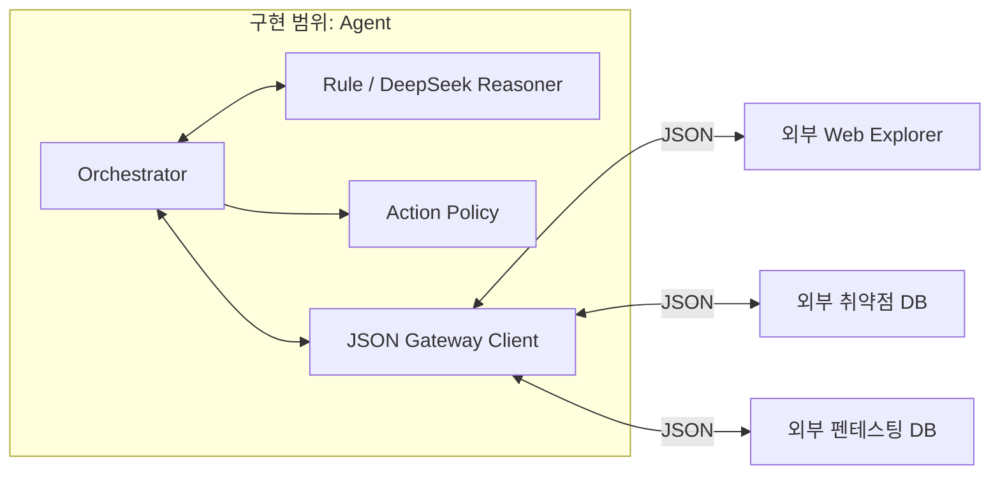

# 펜테스팅 에이전트 개발 계획

## 1. 담당 범위

이 프로젝트에서 구현하는 대상은 첨부 아키텍처의 중앙 **Agent**뿐이다. Web Explorer, 취약점 DB, 펜테스팅 DB는 다른 담당자가 구현하는 독립 모듈이며, 에이전트가 요청할 때 JSON으로 응답하는 black box로 취급한다.



### 구현 범위

- Agent 상태기계와 한 번의 사고 루프
- Reasoning Engine과 향후 LLM/LangChain 교체 지점
- 외부 행동을 제한하는 Agent 내부 정책
- JSON envelope 생성·검증과 correlation
- transport/protocol/외부 모듈 오류 구분
- 외부 모듈 계약과 test-only scripted gateway

### 구현하지 않는 범위

- 웹 탐색, HTTP 요청, 브라우저 자동화와 쿠키 관리
- 취약점 지식의 저장·검색·RAG 구현
- 실행 로그와 finding의 실제 DB·파일 저장
- 대상 사이트 기동, 포트 할당과 프로세스 격리
- 외부 모듈용 HTTP 서버, 메시지 큐 consumer 또는 concrete adapter

## 2. 논문에서 가져온 설계 원칙

로컬 `SOC_LLM_논문정리_2026-09-13.md`의 내용은 직접적인 공격 에이전트 검증 결과가 아니라 설계 참고 자료다.

| 관찰 | Agent 설계 적용 | 한계 |
|---|---|---|
| 보안 작업은 여러 단계와 도구 의존성을 가진다. | 관찰·지식·판단·행동·검증·반영을 상태로 분리한다. | 이 순서의 공격 성공률은 별도 평가가 필요하다. |
| LLM 요약은 누락과 사실성 문제가 있다. | finding을 외부 모듈이 제공한 evidence ID와 연결한다. | evidence 자체의 진실성은 제공 모듈 책임이다. |
| 도구 연동과 간접 주입은 피해를 확대할 수 있다. | 외부 응답을 비신뢰 데이터로 취급하고 Action Policy가 실행 전 검사한다. DeepSeek 경로는 외부 후보를 allowlist view로 투영하고 내부 ID 승인만 허용한다. | 실제 모델의 품질과 새로운 주입 변형 평가는 계속 필요하다. |
| 정상 기능과 보안 속성을 함께 평가해야 한다. | 루프 성공, JSON 계약, 범위 위반, 오류 후 재시도 부재를 각각 테스트한다. | scripted gateway 테스트를 실제 E2E로 해석할 수 없다. |

## 3. 외부 통신 계약

에이전트가 외부 운영 모듈에 요구하는 포트는 하나다. 선택형 DeepSeek provider는 이 포트의 receiver가 아니라 Agent 내부의 별도 전용 client다.

```text
gateway.exchange(serializedRequest: string, { signal }?) -> Promise<serializedResponse: string>
```

모든 요청과 응답은 1 MB 이하의 JSON 문자열 envelope다. 응답은 요청과 동일한 `runId`, `iteration`, 요청 `messageId`를 가리키는 `correlationId`, 정확한 sender/receiver를 가져야 한다.

외부 receiver는 다음 세 개뿐이다.

- `web_explorer`
- `vulnerability_db`
- `pentest_db`

내부 Reasoning Engine과 Action Policy는 외부 모듈이 아니며 gateway receiver가 아니다. 상세 payload 계약은 `EXTERNAL_MODULE_CONTRACTS.md`에 정의한다.

## 4. 최초 단일 루프

준비 요청은 `iteration=0`, 사고 루프는 `iteration=1`이다.

1. Agent → Web Explorer: Alice 세션 확인
2. Agent → Web Explorer: Bob fixture 세션과 canary 준비
3. Agent → Web Explorer: canary 존재 관찰
4. Agent → 취약점 DB: 관찰 결과와 resource ID 매칭
5. Agent 내부: 후보의 전제조건을 평가해 DELETE 행동 생성
6. Agent 내부 Action Policy: 단계별 세션·메서드·경로·body·query·예산과 관찰된 canary의 정확한 리소스·소유자 조합 검사
7. Agent → Web Explorer: DELETE 행동 한 번 요청
8. Agent → Web Explorer: 사후 상태 재관찰
9. Agent 내부: 전 상태·응답·후 상태를 반영해 finding 판정
10. Agent → 펜테스팅 DB: 단계 이벤트와 최종 보고서 전달

Agent 단독 테스트는 이 요청 순서와 JSON 계약, DELETE 1회, `iterations=1`, 증거 연결을 검증한다. 실제 예시 사이트에 대한 공격 성공은 외부 Web Explorer와 DB가 제공된 이후의 통합 완료 기준이다.

## 5. 오류와 안전 규칙

- 외부 모듈의 `module.error`는 `source: external_module`로 보존한다.
- gateway 호출 실패는 `TRANSPORT_FAILURE`, 잘못된 JSON·상관관계는 `PROTOCOL_FAILURE`다.
- 외부 응답은 모듈별 type·필수 payload·evidence 계약을 검증하고 gateway 호출은 10초 후 중단한다.
- 외부 모듈이 주장한 오류 출처는 신뢰하지 않고 응답 sender를 기준으로 provenance를 결정한다.
- 변경 행동은 오류 후 자동 재시도하지 않는다.
- 실패 보고서는 반복 시작, 행동 시도·완료, 검증 완료를 분리해 기록한다.
- raw chain-of-thought, 쿠키와 Authorization header를 Agent가 저장하지 않는다.
- 외부 응답이 다음 반복을 제안해도 MVP는 반복 1회에서 종료한다.

## 6. 단계별 계획

### Phase 0 — Agent Core

- transport-agnostic JSON gateway 계약
- Orchestrator와 단일 상태 루프
- 규칙 기반 Reasoning Engine
- 내부 Action Policy
- 외부 모듈 부재를 검사하는 production-boundary 테스트
- scripted gateway 기반 계약·성공·실패 테스트

### Phase 1 — DeepSeek Reasoning Adapter

- 구현 완료: Reasoning Engine 인터페이스를 구현하는 DeepSeek JSON Output 어댑터
- 구현 완료: candidate ID와 고정 action catalog ID만 선택하도록 출력 제한
- 구현 완료: 모델 출력 strict schema, timeout, 제한된 재시도와 sanitized 오류
- 구현 완료: 고정 provider·설정 모델·검증된 finish reason·정수 token usage만 내부 이벤트에 전달
- 구현 완료: fake fetch/client 기반 오류·prompt injection·비동기 회귀 테스트
- 후속 선택 사항: LangChain 도입 필요성을 별도로 평가하되 현재 직접 client 경계는 유지

### Phase 2 — 외부 모듈 통합

- 다른 담당자가 제공한 gateway transport 연결
- 계약 호환성 테스트
- 실제 `vul-web-1`에 대한 격리된 단일 루프 실행
- Web Explorer evidence와 펜테스팅 DB 기록 readback 검증

### Phase 3 — 제한된 다중 루프

- 반복별 요청·시간·토큰·변경 예산
- 반증과 불확실성에 따른 재계획
- 고영향 행동 승인과 rollback 계약

## 7. Agent 완료 기준

- Production 소스에 Web Explorer·취약점 DB·펜테스팅 DB 구현이 없다.
- Production 소스는 타깃·외부 운영 모듈용 HTTP, 파일 저장, 자식 프로세스 또는 실제 타깃을 직접 사용하지 않는다. 직접 HTTP는 선택형 `DeepSeekClient`에만 한정한다.
- 모든 외부 요청·응답이 직렬화된 JSON envelope다.
- 외부 receiver는 세 모듈로 제한된다.
- Agent가 `observe → knowledge → think → act → verify → reflect → stop`을 한 번 수행한다.
- DELETE 성격의 변경 요청은 최대 한 번이며 오류 후 재시도하지 않는다.
- 성공과 실패 모두 진행 상태가 최종 보고서에 보존된다.
- scripted gateway 테스트를 실제 사이트 E2E 결과로 표현하지 않는다.
