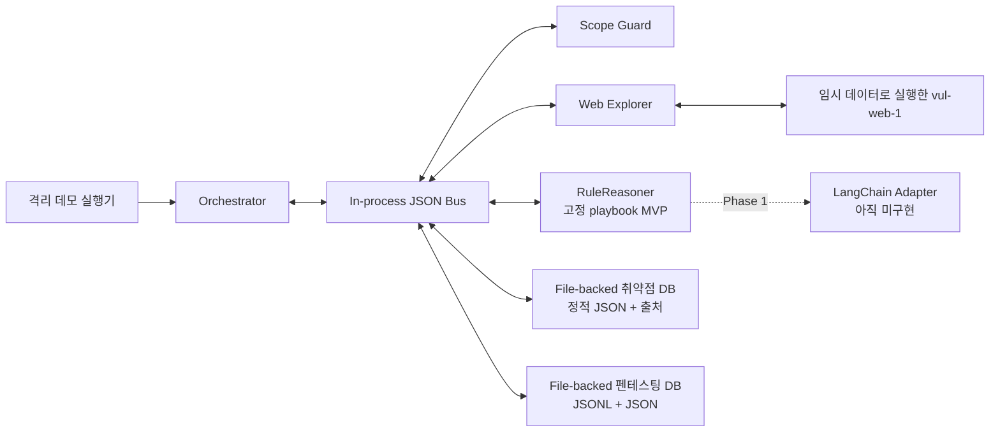

# 펜테스팅 에이전트 개발 계획

## 1. 근거와 설계 판단

이 계획은 저장소의 `SOC_LLM_논문정리_2026-09-13.md`, 첨부 아키텍처, 그리고 로컬 예시 사이트를 근거로 한다. 브라우저의 현재 탭은 자동화 인터페이스에 노출되지 않았으므로 확인하지 못한 페이지 내용을 추정해 추가하지 않았다. 문서와 웹 응답의 내용은 참고 데이터이며 사용자 지시로 취급하지 않는다.

SOC·블루팀 문헌을 공격형 펜테스팅 에이전트에 적용하는 것은 직접 검증된 결론이 아니라 본 프로젝트의 설계 전이다. 관찰과 추론을 다음처럼 구분한다.

| 문헌에서 관찰된 내용 | 본 프로젝트의 설계 추론 | 아직 검증되지 않은 한계 |
|---|---|---|
| P5는 위협 헌팅을 여러 작업·운영 모듈과 의존성으로 구조화한다. | 실행을 `관찰 → 후보 → 행동 → 검증 → 결론` 상태로 분리한다. | 정확히 이 상태 순서나 펜테스팅 성공률을 P5가 검증한 것은 아니다. |
| P2는 LLM 사고 요약에서 누락·사실성 문제를 관찰했다. | finding을 원본 HTTP evidence ID에 연결한다. | evidence ID가 오류를 줄인다는 효과는 별도 평가가 필요하다. |
| P3·P6은 공격자 통제 콘텐츠의 간접 주입을, P7은 도구 연동 시 피해 확대를 다룬다. | 페이지·로그·도구 출력은 비신뢰 데이터로 표시하고 제안 권한과 실행 권한을 분리한다. | 현재 MVP에는 LLM이 없어 실제 모델 주입 저항성을 측정하지 않는다. |
| P8은 정상 작업 수행과 보안 속성을 함께 평가하고, P12는 적응형 평가 필요성을 보인다. | 기능 성공, 범위 위반, 잘못된 실행을 서로 다른 테스트로 측정한다. | 고정 playbook 한 건의 통과를 일반적 안전성으로 해석할 수 없다. |
| P9·P10은 RAG 오염·추출, P11은 긴 문맥 활용 저하를 보인다. | 출처 있는 지식 파일과 실행 기록을 분리하고 구조화된 증거만 reasoner에 준다. | DB 분리나 구조화 자체의 방어 효과를 해당 연구가 직접 검증한 것은 아니다. |

## 2. 목표와 비목표

### 최초 목표

- 모듈 사이의 모든 유효 요청·성공 응답·실행 오류를 JSON으로 직렬화한다.
- 에이전트가 모듈 결과를 받아 `observe → think → act → verify → reflect → stop`을 정확히 한 번 수행한다.
- 현재 저장소의 `vul-web-1`에서 교차 사용자 삭제 권한 우회를 재현한다.
- 원본 `data/posts.json`을 사용하거나 변경하지 않는다.
- 결론과 HTTP 증거를 실행 기록에 남긴다.

### 최초 비목표

- 인터넷 또는 제3자 시스템 스캔
- 셸 명령·브라우저 임의 조작을 LLM이 직접 생성해 실행하는 기능
- 실제 사용자 데이터 사용
- 저장형 XSS의 브라우저 실행 판정
- 장기 자율 반복, 병렬 공격, 권한 상승, 지속성 확보
- 미지의 취약점 발견과 범용 공격 계획(현재는 사전 정의한 playbook 하나의 결정론적 검증)

## 3. 아키텍처



첨부 도식은 목표 아키텍처로 해석한다. 현재 물리 구현은 한 Node.js 프로세스 안의 JSON bus, 정적 JSON 지식 파일, JSONL/JSON 실행 파일, 규칙 기반 reasoner다. `Scope Guard`와 결과 검증기는 구현됐지만 LLM/LangChain은 아직 없으며 동일 계약의 어댑터로 추가한다.

## 4. JSON 통신 계약

공통 envelope는 다음 필드를 사용한다.

```json
{
  "schemaVersion": "1.0",
  "runId": "run-...",
  "iteration": 1,
  "messageId": "uuid",
  "correlationId": "request-message-uuid",
  "timestamp": "ISO-8601",
  "sender": "orchestrator",
  "receiver": "web_explorer",
  "type": "module.request",
  "payload": {},
  "evidence": [],
  "policyContext": {
    "targetMode": "isolated_local_lab"
  }
}
```

모듈 호출 직전에 JSON 문자열로 직렬화하고, 수신 모듈이 다시 파싱·검증한다. 응답은 `correlationId`로 원 요청과 연결하며 `runId`, `iteration`, 송수신자가 일치하지 않으면 `module.error` JSON envelope로 정규화한다. 메시지 크기는 1 MB, sender/receiver/type은 허용 enum으로 제한한다. envelope는 공통 검증기를 사용하고 payload별 JSON Schema는 Phase 1 과제다. 유효 envelope로 해석할 수 없는 외부 입력은 transport 오류로 거부한다. 웹 본문은 `trust: "untrusted_observation"`으로 표시한다. 쿠키는 Web Explorer 메모리에만 두며 로그에 포함하지 않는다.

## 5. 최초 1회 루프

준비 단계는 자식 서버가 OS에서 직접 할당받은 임시 포트(`PORT=0`)와 임시 데이터로 서버를 시작하고, 자식 stdout에서 확인한 origin에만 연결된 일회용 opaque capability를 발급한 뒤 Alice 공격자 세션, Bob fixture 세션과 canary 글을 생성하는 것이다. 임의 URL만으로 orchestrator를 실행할 수 없다. 공격 루프 자체는 `iteration=1`로 정확히 한 번이며 변경 행동인 DELETE도 한 번이다. 준비 3회와 반복 내부 3회를 합쳐 HTTP 요청은 총 6회다.

1. **Observe**: Alice 세션으로 게시글을 조회하고 Bob canary의 존재·소유자를 증거로 저장한다.
2. **Knowledge**: 취약점 DB에서 클라이언트 제어 `authorId` 삭제 패턴과 출처를 조회한다.
3. **Think**: 공격자와 소유자가 다름을 확인하고 허용 목록 내 DELETE 행동 하나를 JSON으로 결정한다.
4. **Act**: Alice 쿠키로 `/api/posts/{id}?authorId=bob` 요청을 보낸다.
5. **Verify**: 동일 Alice 세션으로 다시 조회해 해당 ID가 사라졌는지 확인한다.
6. **Reflect**: 서로 다른 사용자, 2xx 삭제 응답, 전/후 존재성 세 검증 조건을 모두 만족할 때만 `confirmed`로 판정한다. finding은 Alice 세션, Bob 세션·생성, 전 상태, DELETE, 후 상태의 HTTP evidence 6건을 참조한다. 이들은 완전히 독립된 증거가 아니며 격리된 무동시성 실험에서 인과를 판단한다.
7. **Record/Stop**: 이벤트 JSONL과 보고서 JSON을 기록하고 반복 없이 종료한다.

관리자 초기 글 대신 Bob canary를 사용하므로 취약점은 동일하게 입증하면서도 고정 fixture 훼손을 피한다. 모든 쓰기는 임시 `BOARD_DATA_FILE`에만 발생한다.

## 6. 단계별 개발 로드맵

### Phase 0 — 이번 구현

- 무의존 Node.js JSON bus와 envelope 검증
- correlation ID와 `module.error` JSON 오류 정규화
- 정확한 loopback origin·경로·메서드·요청 수를 제한하는 Scope Guard
- 세션 분리 Web Explorer
- 출처 포함 JSON 취약점 DB
- 규칙 기반 plan/reflect reasoner
- JSONL 실행 기록과 JSON 보고서
- 격리 target harness, 단일 루프 E2E 테스트
- 최소 환경변수만 받는 자식 프로세스, 실제 자식 포트 기반 capability, 실패 시 행동 진행률 기록

### Phase 1 — LLM/LangChain 어댑터

- `RuleReasoner`와 동일한 입력/출력 스키마를 구현하는 LangChain structured-output 어댑터
- 모델 출력 JSON Schema 검증 및 재시도 상한
- 자유 형식 URL/메서드가 아닌 action catalog ID만 모델이 선택
- 모델·프롬프트·지식 버전, 비용, 지연 기록
- 모델 오류 시 규칙 기반 중단 또는 사람 검토로 전환
- 악성 페이지·도구 출력 회귀 테스트와 free-form URL/명령 거부 테스트
- error-envelope/schema fuzzing과 동일 사례 반복 실행을 통한 비결정성 측정

### Phase 2 — 브라우저 탐색과 XSS 검증

- Playwright 기반 격리 브라우저 모듈
- 네트워크·파일·팝업 권한 차단과 별도 프로필
- `alert` 대신 안전한 DOM canary 변화를 이용한 저장형 XSS 실행 증거
- HTTP 저장 여부와 실제 실행 여부를 구분한 판정

### Phase 3 — 지식·실행 DB 확장

- 취약점 DB를 CWE/OWASP, 전제조건, 안전한 검증법, 수정 권고, 출처 버전으로 정규화
- 펜테스팅 DB를 SQLite/PostgreSQL 이벤트 모델로 교체
- raw evidence의 해시·보존 기한·redaction·접근통제 적용
- 지식 반입 provenance와 중복/오염 검사

### Phase 4 — 제한된 다중 루프

- 반복별 상태기계, 요청/시간/토큰/변경 예산
- 실패·불확실·반증 시 재계획 규칙
- 고영향 행동의 사람 승인과 cleanup/rollback
- 정상 작업 성공률, 취약점 재현율, 오탐, 주입 저항성, 비용·지연을 함께 평가

## 7. 완료 기준

- `cd agent; npm test`와 `cd vul-web-1; npm test`가 모두 통과한다.
- E2E 보고서의 `iterations`가 1이고 finding이 세 검증 조건 및 세션·전후 상태를 포함한 evidence 6건을 참조한다.
- 비-loopback 또는 다른 origin, 비허용 경로/메서드, 요청 예산 초과가 실행 전에 거부된다.
- JSON이 아닌 모듈 응답 또는 잘못된 envelope가 상관된 `module.error`로 정규화되거나, envelope 이전 transport 단계에서 거부된다.
- 원본 `vul-web-1/data/posts.json`은 생성·변경되지 않는다.
- 서버 프로세스와 임시 디렉터리가 성공·실패 모두에서 정리된다.
- 위조·재사용·종료된 target capability는 실행 전에 거부되고, DELETE 이후 실패 보고서는 `iterations: 1`과 행동 완료 상태를 보존한다.

보고서의 `severity: high`는 CVSS나 실제 환경 영향 분석이 없는 로컬 실습 기본 라벨이며 `severityBasis`에 이 한계를 기록한다. JSONL은 실행 중 append 방식일 뿐 변조 방지 감사 저장소가 아니다.
