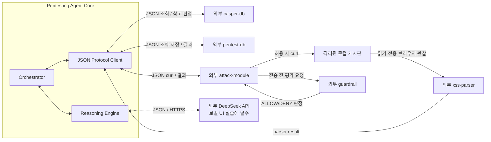

# CA3P 펜테스팅 에이전트 코어 MVP

이 디렉터리의 production 범위는 **에이전트 코어**다. 코어는 `xss-parser`, `casper-db`, `pentest-db`, `attack-module`에 직렬화된 JSON 요청을 보내고 응답을 받아 한 번의 사고 루프를 수행한다. 대시보드의 기본 로컬 실습은 `stored_xss_canary` 프로필이며, 기존 `agent_cross_user_delete_canary`는 명시적으로 선택하는 레거시 프로필이다. 코어 fixture는 scripted 응답으로 동작한다. 실제 브라우저·DB·curl·`guardrail` 연결은 [`agent-dashboard/local-lab-gateway.mjs`](../agent-dashboard/local-lab-gateway.mjs)와 그 어댑터가 담당한다.

다음 기능은 에이전트 디렉터리의 production 코드에 포함하지 않는다.

- `xss-parser`의 Chromium 실행, 세션과 쿠키 관리
- attack-module의 curl 실행과 응답 파싱
- `casper-db`의 SQLite 검색·출처 관리
- `pentest-db`의 카탈로그 조회와 파일 저장
- `guardrail` 규칙 평가
- 예시 사이트 프로세스 실행과 격리

## 현재 계약

- 에이전트 코어와 외부 모듈 구현을 분리했다. 로컬 실습 연결은 `agent-dashboard/local-lab-gateway.mjs`가 담당한다.
- 외부 통신을 `gateway.exchange(serializedRequest, { signal }?)` JSON 포트 하나로 통일했다.
- 모듈별 응답 type·payload, HTTP 결과의 `evidenceId` 존재 여부, sender, correlation, 1 MB 크기 제한과 timeout을 검증한다. Evidence 내용의 진위는 제공 모듈 책임이다.
- 외부 오류와 Agent gateway 오류의 provenance를 분리하고 외부 모듈의 출처 위조를 차단한다.
- 기본 로컬 XSS 프로필은 `xss-parser`의 읽기 전용 브라우저 스캔으로 입력·HTML sink를 관찰하고, 검사 POST 후 별도 브라우저에서 같은 canary의 실행을 확인한다. HTTP GET·POST는 구조화된 curl JSON으로 `attack-module`에 보낸다. 로컬 gateway가 순서·원점·canary 범위를 검사하고 실제 `guardrail`이 전송 전에 요청을 평가한다. 레거시 BOLA 프로필만 Bob의 canary 생성과 Alice의 DELETE를 사용한다.
- 외부 응답을 모사해 한 번의 Agent 루프 계약을 검증하는 scripted JSON stub을 test-support에만 두었다. 이는 production 외부 모듈이나 실제 E2E 구현이 아니다.

## 현재 구조



`gateway.exchange(serializedRequest)`는 parser·attack module·과거 사례 DB·펜테스팅 DB를 위한 유일한 외부 모듈 포트다. `guardrail`은 gateway의 attack-module 전송 경계에서 평가되고 판정이 `attack.result`에 포함된다. DeepSeek Provider만 별도의 전용 client를 사용하며, 대시보드 로컬 실습에는 API 설정이 필수다. 코어 fixture와 단위 테스트는 모델 API를 호출하지 않는다. 상세 계약은 [EXTERNAL_MODULE_CONTRACTS.md](./EXTERNAL_MODULE_CONTRACTS.md)에 있다.

## 에이전트 루프

대시보드의 기본 `stored_xss_canary` 로컬 실습은 다음 순서로 진행한다.

1. `attack-module`로 Alice 세션 GET을 준비한다. `iteration=1`에서 `xss-parser`가 게시판 한 페이지의 폼, `POST /api/posts` 입력, `.post-content`의 HTML sink를 변경 없이 관찰한다.
2. `casper-db`에 parser 원본 보고서를 보내 과거 사례를 조회한다. `pentest-db`의 초안 stored-XSS 카탈로그는 입력 위치와 브라우저 확인 방법에 대한 조언으로 사용한다. 과거 사례 일치나 카탈로그만으로 finding을 확정하지 않는다.
3. 코어가 현재 실행에 고유한 무해한 마커·제목·본문을 만들고, 관찰된 입력과 카탈로그 조언이 일치할 때만 단일 `POST /api/posts` 후보를 계획한다. DeepSeek가 제안한 `{method,url,body}` curl JSON은 코어가 계산한 허용 canary 요청과 정확히 같아야 한다.
4. 로컬 gateway가 요청 순서·원점·본문을 검사한다. `guardrail` 허용 판정 후 `attack-module`이 검사 POST를 한 번 실행한다. 코어는 생성 응답의 게시글 ID·작성자·제목·본문을 확인한다.
5. `xss-parser` 어댑터가 새 Chromium 브라우저에서 같은 게시글을 다시 열어 고유 마커의 콜백 실행을 관찰한다. 로컬 `reflect()`는 생성 상태, 게시글·마커 일치, 같은 원점, DOM 표시, 실제 브라우저 콜백과 오류 부재를 확인해 결정론적으로 finding을 판정한다.
6. 각 단계와 최종 보고서를 `pentest-db`에 JSON으로 전달한다.

기존 `agent_cross_user_delete_canary` 프로필은 Bob의 canary 게시글을 만든 뒤 Alice 세션에서 해당 글의 DELETE 권한을 확인한다. 코어 fixture와 `npm run demo`는 scripted 응답을 사용하며 실제 사이트에 접속하지 않는다. 기본 Reasoning Engine은 재현 가능한 규칙 기반 구현이다. 로컬 UI 실습에서는 DeepSeek 어댑터의 `curlMode`가 필요하고, 모델이 반환한 curl JSON을 코어와 gateway가 다시 검사한다.

## DeepSeek API 어댑터

DeepSeek의 OpenAI 호환 Chat Completions API를 Agent 내부 Reasoning Provider로 연결했다. 공식 기본 endpoint는 `https://api.deepseek.com/chat/completions`이고 기본 모델은 현재 공식 Quick Start의 `deepseek-flash`다. 구현 기준은 [DeepSeek API 문서](https://api-docs.deepseek.com/guides/codex), [JSON Output 문서](https://api-docs.deepseek.com/guides/json_mode/), [오류 코드 문서](https://api-docs.deepseek.com/quick_start/error_codes/)다.

연결 경계는 다음과 같다.

```text
Orchestrator -> DeepSeekReasoningEngine -> RuleReasoningEngine -> canonical baseline
                    |                                      |
                    |<-------------------------------------+
                    v
             DeepSeekClient -> DeepSeek API -> ID + curl JSON / 중단
                    |
                    v
             canary에 바인딩된 action + 검증된 curl JSON -> gateway/guardrail -> attack-module -> curl
```

안전 경계는 다음과 같다.

- 증거 기반 `reflect()`와 finding 확정은 결정론적 로컬 코드에 유지한다.
- 기본 어댑터는 허용된 `candidateId`와 고정 `actionCatalogId`만 선택한다. 로컬 실습의 `curlMode`에서는 기본 XSS 프로필에 `{method,url,body}` POST JSON을 반환하며, 사전 계산된 허용 요청과 정확히 같아야 한다. 본문은 코어가 만든 고유 마커의 제목·내용으로 고정된다. 레거시 BOLA 프로필에서는 `{method,url}` DELETE JSON을 사용한다. 셸 문자열·curl 옵션·헤더는 모델 출력으로 받지 않는다.
- `RuleReasoningEngine`이 모델 호출 전에 canonical action을 만든다. 외부 DB의 `knowledgeId`는 모델 prompt의 ID로 사용하지 않는다.
- 모델 JSON은 정확한 키·enum·ID·길이를 로컬에서 재검증한다. 빈 응답, 잘린 응답, 추가 필드, 알 수 없는 ID와 schema 오류는 행동 전에 실패한다.
- 모든 모델 제안은 코어의 canary 동등성 검사와 로컬 gateway의 고정 순서를 통과해야 한다. `guardrail`이 실제 전송 직전 정책 판정을 내린다. 대시보드 실습 대상은 실행 시 만든 소유 로컬 게시판으로 고정되며 입력한 임의 URL에는 접속하지 않는다.
- API 키, Authorization header, provider request ID, 원문 모델 응답과 raw chain-of-thought는 이벤트나 보고서에 저장하지 않는다. 로컬에서 고정한 provider·설정 모델, 검증된 종료 상태와 정수 token usage만 기록할 수 있다.
- 모델 호출 timeout과 최대 2회의 제한된 재시도는 변경 행동 전에만 적용한다. 검사 POST와 레거시 DELETE는 자동 재시도하지 않는다.

설정은 `agent/.env` 또는 프로세스 환경변수에서 읽으며 프로세스 환경변수가 우선한다.

| 변수 | 기본값 | 제약 |
| --- | --- | --- |
| `DEEPSEEK_API_KEY` | 없음 | 필수, 출력·커밋 금지 |
| `DEEPSEEK_MODEL` | `deepseek-flash` | `deepseek-flash` 또는 `deepseek-v4-pro` |
| `DEEPSEEK_BASE_URL` | `https://api.deepseek.com` | 공식 HTTPS host, 또는 명시적인 loopback HTTP만 허용 |
| `DEEPSEEK_TIMEOUT_MS` | `60000` | 1~600000ms |
| `DEEPSEEK_MAX_RETRIES` | `1` | 0~2 |
| `DEEPSEEK_MAX_TOKENS` | `512` | 64~8192 |

실제 API를 사용하는 opt-in 계약 데모는 다음 명령이다. 이 명령은 **과금될 수 있는 DeepSeek 모델 호출**을 수행하며, 일시적 오류에는 설정된 한도 안에서 HTTP 요청이 재시도될 수 있다. 외부 모듈은 scripted test double이므로 실제 사이트에 접속하지 않는다.

```powershell
cd .\agent
npm run demo:deepseek
```

기본 `npm test`와 `npm run demo`는 DeepSeek 네트워크를 호출하지 않는다. 세부 설계와 rollout은 [DEEPSEEK_ADAPTER_PLAN.md](./DEEPSEEK_ADAPTER_PLAN.md)에 있다.

2026-10-06 실제 API contract test 결과와 sanitized 실행 화면은 [DEEPSEEK_LIVE_API_TEST_REPORT_2026-10-06.md](./DEEPSEEK_LIVE_API_TEST_REPORT_2026-10-06.md)에 기록했다. 이 테스트에서 DeepSeek Provider만 실제 연결했고 외부 운영 모듈은 scripted test double을 사용했다. `targetOrigin`은 scope 입력으로만 사용했으며 실제 target 접속은 없었다.

## 실행과 검증

```powershell
cd .\agent
npm test
npm run demo
```

`npm test`와 `npm run demo`는 `test-support/scripted-gateway.js`를 사용한다. 이 gateway는 외부 모듈을 구현하지 않고 미리 정한 JSON 응답과 인메모리 상태 전이만 제공하는 테스트 대역이다.

`npm run demo`는 에이전트 계약과 한 번의 루프를 보여줄 뿐 실제 사이트에 접속하지 않는다. 실제 `vul-web-1` 저장형 XSS 로컬 실습은 프로젝트 루트에서 `npm start` 후 대시보드의 **로컬 실습 시작**을 선택한다. 이 경로는 서버가 만든 격리된 loopback 게시판만 대상으로 하며 `DEEPSEEK_API_KEY`가 필요하다. 브라우저·gateway를 포함한 비용 없는 통합 테스트는 `cd .\agent-dashboard; npm run check; npm test`로 실행한다. 이 테스트는 모델 요청을 가짜 클라이언트로 대체한다.

## Production 파일

- `src/orchestrator.js`: 외부 결과를 받아 단일 사고 루프 실행
- `src/reasoning-engine.js`: 에이전트 내부 plan/reflect
- `src/deepseek-client.js`: timeout·재시도·JSON Output 검증을 포함한 DeepSeek 전용 HTTP client
- `src/deepseek-reasoning-engine.js`: 기본 ID 선택 및 선택형 curl JSON 생성·검증 어댑터
- `src/deepseek-config.js`: `.env`/환경변수 설정 로딩과 어댑터 factory
- `src/curl-command.js`: canonical HTTP action을 구조화된 curl JSON으로 변환
- `src/xss-canary.js`: 실행별 고유 마커와 고정된 무해한 XSS 확인 본문 생성
- `src/protocol.js`: JSON envelope, 상관관계, 오류 정규화
- `src/index.js`: 공개 API

Production 소스에는 타깃 사이트·외부 모듈용 HTTP client/server, 파일 DB, 자식 프로세스 또는 외부 모듈 concrete class가 없다. 유일한 직접 HTTP client는 Agent 내부 선택형 DeepSeek Provider 전용이다.
