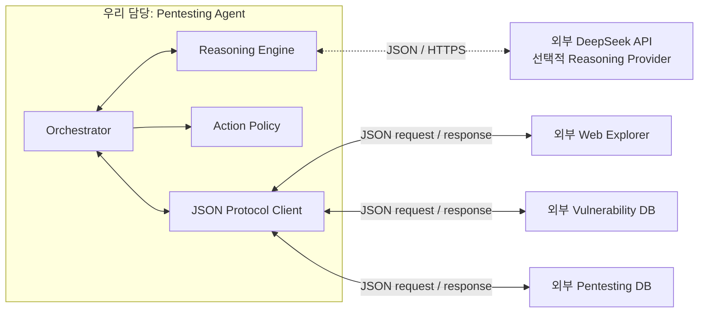

# CA3P 펜테스팅 에이전트 코어 MVP

이 디렉터리의 production 범위는 **에이전트만** 포함한다. 에이전트는 외부 Web Explorer, 취약점 DB, 펜테스팅 DB에 직렬화된 JSON 요청을 보내고 직렬화된 JSON 응답을 받아 한 번의 사고 루프를 수행한다.

다음 외부 모듈은 이 저장소에서 구현하지 않는다.

- Web Explorer의 HTTP·브라우저 실행, 세션과 쿠키 관리
- 취약점 DB의 검색·저장·출처 관리
- 펜테스팅 DB의 파일·데이터베이스 저장
- 예시 사이트 프로세스 실행과 격리

## 이번 변경 사항

- Web Explorer, 취약점 DB, 펜테스팅 DB와 대상 사이트 harness 구현을 production 코드에서 제거했다.
- 외부 통신을 `gateway.exchange(serializedRequest, { signal }?)` JSON 포트 하나로 통일했다.
- 모듈별 응답 type·payload, Web Explorer의 `evidenceId` 존재 여부, sender, correlation, 1 MB 크기 제한과 timeout을 검증한다. Evidence 내용의 진위는 제공 모듈 책임이다.
- 외부 오류와 Agent gateway 오류의 provenance를 분리하고 외부 모듈의 출처 위조를 차단한다.
- Reasoning Engine이 제안한 행동은 단계별 Action Policy와 관찰된 canary 제약을 모두 통과해야 한다.
- 외부 응답을 모사해 한 번의 Agent 루프 계약을 검증하는 scripted JSON stub을 test-support에만 두었다. 이는 production 외부 모듈이나 실제 E2E 구현이 아니다.

## 현재 구조



`gateway.exchange(serializedRequest)`는 Web Explorer·취약점 DB·펜테스팅 DB를 위한 유일한 외부 모듈 포트다. 선택형 DeepSeek Provider만 별도의 전용 client를 사용한다. gateway 전송 방식은 HTTP, 메시지 큐, stdio 등으로 교체할 수 있으며 에이전트 코어는 이를 알지 못한다. 상세 계약은 [EXTERNAL_MODULE_CONTRACTS.md](./EXTERNAL_MODULE_CONTRACTS.md)에 있다.

## 에이전트 루프

1. Web Explorer에 공격자 세션, fixture 세션과 canary 준비를 JSON으로 요청한다.
2. `iteration=1`에서 Web Explorer에 관찰을 요청한다.
3. 취약점 DB에 관찰 결과 매칭을 요청한다.
4. 에이전트 내부 Reasoning Engine이 후보를 평가하고 행동을 만든다.
5. Action Policy가 `loop.act` 단계에는 관찰된 canary의 정확한 리소스·소유자 조합을 쓰는 DELETE만 허용한 뒤 Web Explorer에 한 번 요청한다.
6. Web Explorer에 재관찰을 요청하고 에이전트 내부에서 결과를 판정한다.
7. 각 단계와 최종 보고서를 펜테스팅 DB에 JSON으로 전달한다.

기본 Reasoning Engine은 재현 가능한 규칙 기반 구현이다. 선택적으로 DeepSeek 어댑터를 주입할 수 있으며 외부 모듈 JSON 계약에는 영향을 주지 않는다.

## DeepSeek API 어댑터

DeepSeek의 OpenAI 호환 Chat Completions API를 Agent 내부 Reasoning Provider로 연결했다. 공식 기본 endpoint는 `https://api.deepseek.com/chat/completions`이고 기본 모델은 현재 공식 Quick Start의 `deepseek-flash`다. 구현 기준은 [DeepSeek API 문서](https://api-docs.deepseek.com/guides/codex), [JSON Output 문서](https://api-docs.deepseek.com/guides/json_mode/), [오류 코드 문서](https://api-docs.deepseek.com/quick_start/error_codes/)다.

연결 경계는 다음과 같다.

```text
Orchestrator -> DeepSeekReasoningEngine -> RuleReasoningEngine -> canonical baseline
                    |                                      |
                    |<-------------------------------------+
                    v
             DeepSeekClient -> DeepSeek API -> ID 승인/중단
                    |
                    v
             기존 canonical action -> Action Policy -> Web Explorer
```

안전 경계는 다음과 같다.

- `plan()`의 후보 선택만 DeepSeek에 위임하고 증거 기반 `reflect()`와 finding 확정은 결정론적 로컬 코드에 유지한다.
- 모델은 임의 URL, HTTP method, body 또는 query를 만들 수 없다. 허용된 `candidateId`와 고정 `actionCatalogId`만 선택한다.
- 기존 `RuleReasoningEngine`이 모델 호출 전에 canonical action을 만들고, 모델은 내부 `candidateId`와 고정 `actionCatalogId`만 승인하거나 중단한다. 외부 DB의 `knowledgeId`는 모델 prompt의 ID로 사용하지 않는다.
- 모델 JSON은 정확한 키·enum·ID·길이를 로컬에서 재검증한다. 빈 응답, 잘린 응답, 추가 필드, 알 수 없는 ID와 schema 오류는 행동 전에 실패한다.
- 모든 모델 제안은 기존 Action Policy를 통과해야 하며, 정책이 실제 실행 권한의 최종 결정자다.
- API 키, Authorization header, provider request ID, 원문 모델 응답과 raw chain-of-thought는 이벤트나 보고서에 저장하지 않는다. 로컬에서 고정한 provider·설정 모델, 검증된 종료 상태와 정수 token usage만 기록할 수 있다.
- 모델 호출 timeout과 최대 2회의 제한된 재시도는 부작용 행동 전에만 적용한다. DELETE 같은 변경 행동은 기존과 같이 재시도하지 않는다.

설정은 `agent/.env` 또는 프로세스 환경변수에서 읽으며 프로세스 환경변수가 우선한다.

| 변수 | 기본값 | 제약 |
| --- | --- | --- |
| `DEEPSEEK_API_KEY` | 없음 | 필수, 출력·커밋 금지 |
| `DEEPSEEK_MODEL` | `deepseek-flash` | `deepseek-flash` 또는 `deepseek-v4-pro` |
| `DEEPSEEK_BASE_URL` | `https://api.deepseek.com` | 공식 HTTPS host, 또는 명시적인 loopback HTTP만 허용 |
| `DEEPSEEK_TIMEOUT_MS` | `60000` | 1~600000ms |
| `DEEPSEEK_MAX_RETRIES` | `1` | 0~2 |
| `DEEPSEEK_MAX_TOKENS` | `512` | 64~8192 |

실제 API를 사용하는 opt-in 데모는 다음 명령이다. 이 명령은 **과금될 수 있는 DeepSeek 모델 호출**을 수행하며, 일시적 오류에는 설정된 한도 안에서 HTTP 요청이 재시도될 수 있다. Web Explorer와 DB는 여전히 scripted test double이므로 실제 사이트를 공격하지 않는다.

```powershell
cd .\agent
npm run demo:deepseek
```

기본 `npm test`와 `npm run demo`는 DeepSeek 네트워크를 호출하지 않는다. 세부 설계와 rollout은 [DEEPSEEK_ADAPTER_PLAN.md](./DEEPSEEK_ADAPTER_PLAN.md)에 있다.

2026-10-06 실제 API contract test 결과와 sanitized 실행 화면은 [DEEPSEEK_LIVE_API_TEST_REPORT_2026-10-06.md](./DEEPSEEK_LIVE_API_TEST_REPORT_2026-10-06.md)에 기록했다. 이 테스트에서 DeepSeek Provider만 실제 연결했고 외부 운영 모듈은 scripted test double을 사용했다. `targetOrigin`은 scope 입력으로만 사용했으며 실제 target 접속은 없었다.

## 실행과 검증

```powershell
cd .\agent
npm test
npm run demo
```

`npm test`와 `npm run demo`는 `test-support/scripted-gateway.js`를 사용한다. 이 gateway는 외부 모듈을 구현하지 않고 미리 정한 JSON 응답과 인메모리 상태 전이만 제공하는 테스트 대역이다.

`npm run demo`는 에이전트 계약과 한 번의 루프를 보여줄 뿐 실제 사이트에 접속하거나 공격하지 않는다. 실제 `vul-web-1` 통합 공격은 다른 담당자가 구현한 Web Explorer·DB gateway가 제공된 뒤 수행해야 한다.

## Production 파일

- `src/orchestrator.js`: 외부 결과를 받아 단일 사고 루프 실행
- `src/reasoning-engine.js`: 에이전트 내부 plan/reflect
- `src/deepseek-client.js`: timeout·재시도·JSON Output 검증을 포함한 DeepSeek 전용 HTTP client
- `src/deepseek-reasoning-engine.js`: 모델 ID 선택을 로컬 canonical action으로 변환하는 어댑터
- `src/deepseek-config.js`: `.env`/환경변수 설정 로딩과 어댑터 factory
- `src/action-policy.js`: 외부로 보내기 전 행동 범위와 요청 예산 검사
- `src/protocol.js`: JSON envelope, 상관관계, 오류 정규화
- `src/index.js`: 공개 API

Production 소스에는 타깃 사이트·외부 모듈용 HTTP client/server, 파일 DB, 자식 프로세스 또는 외부 모듈 concrete class가 없다. 유일한 직접 HTTP client는 Agent 내부 선택형 DeepSeek Provider 전용이다.
