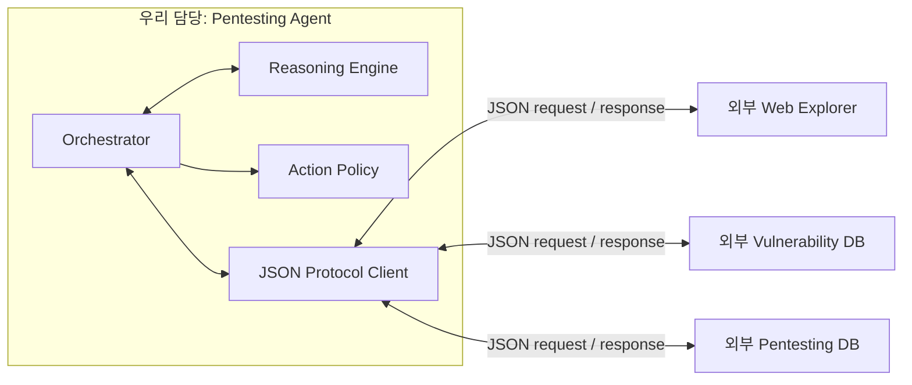

# 펜테스팅 에이전트 코어 MVP

이 디렉터리의 production 범위는 **에이전트만** 포함한다. 에이전트는 외부 Web Explorer, 취약점 DB, 펜테스팅 DB에 직렬화된 JSON 요청을 보내고 직렬화된 JSON 응답을 받아 한 번의 사고 루프를 수행한다.

다음 외부 모듈은 이 저장소에서 구현하지 않는다.

- Web Explorer의 HTTP·브라우저 실행, 세션과 쿠키 관리
- 취약점 DB의 검색·저장·출처 관리
- 펜테스팅 DB의 파일·데이터베이스 저장
- 예시 사이트 프로세스 실행과 격리

## 이번 변경 사항

- Web Explorer, 취약점 DB, 펜테스팅 DB와 대상 사이트 harness 구현을 production 코드에서 제거했다.
- 외부 통신을 `gateway.exchange(serializedRequest, { signal }?)` JSON 포트 하나로 통일했다.
- 모듈별 응답 type·payload, Web Explorer의 `evidenceId` 존재 여부, sender, correlation, 1 MB 크기 제한과 timeout을 검증한다. Evidence 내용의 진위는 제공 모듈 책임이다.
- 외부 오류와 Agent gateway 오류의 provenance를 분리하고 외부 모듈의 출처 위조를 차단한다.
- Reasoning Engine이 제안한 행동은 단계별 Action Policy와 관찰된 canary 제약을 모두 통과해야 한다.
- 외부 응답을 모사해 한 번의 Agent 루프 계약을 검증하는 scripted JSON stub을 test-support에만 두었다. 이는 production 외부 모듈이나 실제 E2E 구현이 아니다.

## 현재 구조



`gateway.exchange(serializedRequest)`가 유일한 외부 포트다. 전송 방식은 HTTP, 메시지 큐, stdio 등으로 교체할 수 있으며 에이전트 코어는 이를 알지 못한다. 상세 계약은 [EXTERNAL_MODULE_CONTRACTS.md](./EXTERNAL_MODULE_CONTRACTS.md)에 있다.

## 에이전트 루프

1. Web Explorer에 공격자 세션, fixture 세션과 canary 준비를 JSON으로 요청한다.
2. `iteration=1`에서 Web Explorer에 관찰을 요청한다.
3. 취약점 DB에 관찰 결과 매칭을 요청한다.
4. 에이전트 내부 Reasoning Engine이 후보를 평가하고 행동을 만든다.
5. Action Policy가 `loop.act` 단계에는 관찰된 canary의 정확한 리소스·소유자 조합을 쓰는 DELETE만 허용한 뒤 Web Explorer에 한 번 요청한다.
6. Web Explorer에 재관찰을 요청하고 에이전트 내부에서 결과를 판정한다.
7. 각 단계와 최종 보고서를 펜테스팅 DB에 JSON으로 전달한다.

Reasoning Engine은 현재 재현 가능한 규칙 기반 구현이다. 향후 LLM/LangChain 어댑터는 이 내부 인터페이스를 대체하며, 외부 모듈 계약에는 영향을 주지 않는다.

## DeepSeek API 연결 계획 (미구현)

**현재 DeepSeek API는 연결되어 있지 않다.** DeepSeek 어댑터, API client 의존성, 키 로딩 코드가 없으므로 `DEEPSEEK_API_KEY`를 설정해도 현 버전은 사용하지 않는다. 다만 DeepSeek가 제공하는 OpenAI 호환 API를 Agent 내부 Reasoning Engine 어댑터로 연결할 수 있다. 공식 기본 endpoint와 JSON 출력 방식은 [DeepSeek API 문서](https://api-docs.deepseek.com/guides/codex)와 [JSON Output 문서](https://api-docs.deepseek.com/guides/json_mode/)를 기준으로 한다.

예정된 연결 경계는 다음과 같다.

```text
Orchestrator -> DeepSeekReasoningEngine (예정) -> 주입된 API client -> DeepSeek API
             -> Action Policy -> 외부 Web Explorer
```

초기 통합 원칙은 다음과 같다.

- `plan()` 호출만 DeepSeek에 위임하고 증거 기반 `reflect()`와 finding 확정은 결정론적 로컬 코드에 유지한다.
- 모델은 임의 URL, HTTP method 또는 body를 만들지 않고 검증된 후보와 action catalog ID만 구조화 JSON으로 선택한다.
- DeepSeek JSON Output을 파싱한 뒤 Agent가 로컬 도메인 schema를 별도로 검증하며, 출력이 비어 있거나 잘렸거나 검증에 실패하면 행동 없이 종료한다.
- 모든 모델 제안은 기존 Action Policy를 통과해야 하며, 정책이 실제 실행 권한의 최종 결정자다.
- API 키, 쿠키, Authorization header와 raw chain-of-thought는 prompt, 이벤트, 보고서에 저장하지 않는다.
- 모델 호출 timeout과 제한된 재시도는 부작용 행동 전에만 적용하며 DELETE 같은 변경 행동은 재시도하지 않는다.

실제 연결을 구현할 때는 `plan()`/`reflect()` 호출의 비동기 지원, 주입식 DeepSeek client, 출력 schema, fake-client 테스트와 opt-in live smoke test가 추가로 필요하다. API 키는 저장소 파일이 아니라 `DEEPSEEK_API_KEY` 환경변수 또는 별도 secret manager에서만 공급한다.

## 실행과 검증

```powershell
cd .\agent
npm test
npm run demo
```

`npm test`와 `npm run demo`는 `test-support/scripted-gateway.js`를 사용한다. 이 gateway는 외부 모듈을 구현하지 않고 미리 정한 JSON 응답과 인메모리 상태 전이만 제공하는 테스트 대역이다.

`npm run demo`는 에이전트 계약과 한 번의 루프를 보여줄 뿐 실제 사이트에 접속하거나 공격하지 않는다. 실제 `vul-web-1` 통합 공격은 다른 담당자가 구현한 Web Explorer·DB gateway가 제공된 뒤 수행해야 한다.

## Production 파일

- `src/orchestrator.js`: 외부 결과를 받아 단일 사고 루프 실행
- `src/reasoning-engine.js`: 에이전트 내부 plan/reflect
- `src/action-policy.js`: 외부로 보내기 전 행동 범위와 요청 예산 검사
- `src/protocol.js`: JSON envelope, 상관관계, 오류 정규화
- `src/index.js`: 공개 API

Production 소스에는 HTTP 클라이언트·서버, 파일 DB, 자식 프로세스, 외부 모듈 concrete class가 없다.
