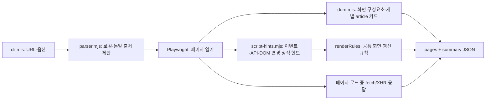

# xss-parser: 방문한 페이지의 화면·클라이언트 동작 지도

실행 중인 로컬 웹사이트 URL을 받아 **방문할 수 있었던 페이지의 클라이언트 구조**를 JSON 한 파일로 정리합니다. 기본 구조는 `pages → areas → forms / fields / buttons / links / outputs`이며, 화면에 나타난 `article` 카드의 개별 정보는 `posts`로 기록합니다. **동작 힌트** `behaviors`는 공통 화면 갱신 규칙 `renderRules`를 ID로 참조하고, 페이지 로드 중 **실제로 응답을 받은 요청**은 `observedRequests`에 기록합니다. AI가 화면의 입력칸, 버튼, 게시글, 결과 영역을 보고 관련 API 주소를 찾되, 코드에서 추정한 경로를 실행 결과로 착각하지 않도록 구분했습니다. 서버 전체의 경로·권한·저장 구조를 그리는 도구는 아닙니다.

이 도구는 파서입니다. 입력값 주입, 버튼 클릭, 폼 제출, 취약점 판정은 하지 않습니다.

## 실행

Node.js 20 이상과 Chrome 또는 Chromium이 필요합니다. macOS에 Chrome이 있으면 자동으로 사용합니다. 없으면 `npx playwright install chromium`으로 Chromium을 설치하세요. 저장소의 `xss-parser` 폴더에서 터미널 두 개를 엽니다.

터미널 1 — 포함된 실습 게시판 실행:

```sh
npm install
npm start
```

터미널 2 — 파서 실행:

```sh
npm run parse -- --url http://127.0.0.1:3000/ --out report.json
```

`report.json`은 현재 폴더에 저장됩니다. `--out`을 빼면 결과가 터미널에 출력됩니다. `npm run parse --` 뒤의 옵션은 파서로 전달됩니다. 검증은 `npm test`로 실행합니다.

| 옵션 | 설명 |
| --- | --- |
| `--url URL` | **필수.** 시작 주소. `localhost`, `127.0.0.1`, `[::1]`의 HTTP(S)만 허용 |
| `--out FILE` | JSON 저장 경로. 생략하면 터미널 출력 |
| `--max-pages N` | 같은 출처에서 방문할 최대 페이지 수. 기본 10, 범위 1~30 |
| `--wait-ms N` | 페이지가 열린 뒤 동적 화면을 기다릴 시간(ms). 기본 500, 범위 0~5000 |
| `--timeout-ms N` | 페이지 이동 제한 시간(ms). 기본 10000, 범위 1000~30000 |
| `--browser FILE` | Chrome/Chromium 실행 파일 경로 |
| `--headed` | 파싱 중 브라우저 창 표시 |
| `--hide-body` | `posts[].body.preview`를 `null`로 출력하여 게시글 본문 미리보기를 가림 |
| `--help`, `-h` | 도움말 |

## JSON 구성

```json
{
  "schemaVersion": "3.4",
  "startUrl": "http://127.0.0.1:3000/",
  "pages": [{
    "id": "page-1",
    "url": "http://127.0.0.1:3000/",
    "title": "모아 · 작은 게시판",
    "areas": [{
      "id": "page-1-area-1",
      "name": "새 글 쓰기",
      "kind": "section",
      "selector": "section.compose-panel",
      "parent": null,
      "forms": [{
        "selector": "#post-form",
        "htmlMethod": "GET",
        "htmlAction": "http://127.0.0.1:3000/",
        "fields": [{ "selector": "#post-title", "name": "title", "label": "제목", "type": "text", "required": true, "editable": true, "visible": true }]
      }],
      "buttons": [{ "selector": "#publish-button", "label": "게시글 올리기", "type": "submit", "visible": true, "form": "#post-form" }]
    }],
    "posts": [{
      "selector": "#post-list > article:nth-of-type(1)",
      "id": "3",
      "idSource": "visible-label",
      "author": "밥",
      "title": "오늘의 첫 인사 👋",
      "body": {
        "selector": "#post-list > article:nth-of-type(1) > div:nth-of-type(2)",
        "preview": "반갑습니다! 여러분의 이야기가 궁금해요.",
        "length": 22,
        "previewTruncated": false,
        "renderRef": "page-1-render-1"
      }
    }],
    "behaviors": [{
      "trigger": { "event": "submit", "selector": "#post-form" },
      "api": [{ "method": "POST", "url": "http://127.0.0.1:3000/api/posts", "bodyKeys": ["title", "content"] }],
      "renderRefs": ["page-1-render-1"],
      "evidence": "static-js",
      "script": "http://127.0.0.1:3000/app.js"
    }],
    "renderRules": [{ "id": "page-1-render-1", "selector": ".post-content", "operation": "innerHTML", "value": "post.content", "evidence": "static-js" }],
    "observedRequests": [{ "method": "GET", "url": "http://127.0.0.1:3000/api/posts", "status": 200 }]
  }],
  "summary": { "scope": "visited-client-pages", "pages": 1, "areas": 1, "forms": 1, "fields": 1, "buttons": 1, "links": 0, "outputs": 0, "posts": 1, "behaviors": 1, "observedRequests": 1, "errors": 0, "truncated": false }
}
```

위는 **구조를 설명하기 위해 항목을 덜어낸 예시**입니다. 실제 게시판 결과에는 다른 영역, `content` 입력칸, 나머지 게시글, 더 많은 동작·요청과 렌더링 규칙이 있습니다. 예시의 개수는 일부 항목만 보여줍니다. 빈 `forms`, `fields`, `buttons`, `links`, `outputs`, `posts`, `behaviors`, `renderRules`, `observedRequests` 목록은 키 자체를 생략합니다.

| 키 | 의미 |
| --- | --- |
| `schemaVersion` | 결과 형식 버전 |
| `startUrl` | 시작 주소. URL 쿼리 값은 `{value}`로 가림 |
| `pages[]` | 방문 페이지. `id`, `url`, `title`과 수집된 `areas`, `posts`, `behaviors`, `renderRules`, `observedRequests`가 있음. 방문 실패 시 `error` 추가 |
| `areas[]` | `header`, `nav`, `main`, `section`, `aside`, `footer`, `dialog` 등 화면 영역. `parent`는 부모 영역 ID |
| `forms[]` | 폼 위치와 소속 입력칸. `htmlMethod`·`htmlAction`은 **HTML 속성 또는 브라우저 기본값**이며 실제 JS 요청이 아님 |
| `fields[]` | 폼 밖의 입력칸. 폼 소속 입력칸은 `forms[].fields[]`에만 있음. 현재 입력값은 저장하지 않음 |
| `buttons[]` | 버튼의 이름·종류·위치. 소속 폼이 있으면 `form` 선택자 포함 |
| `links[]` | 링크의 주소와 `visited` 여부. `visited`는 파서가 방문했다는 뜻 |
| `outputs[]` | 글 목록, 게시글, 표, 상태 메시지 등의 위치와 반복 개수 `count` |
| `posts[]` | 렌더링된 `article` 카드별 위치·ID·표시 작성자·제목·본문 미리보기·표시된 버튼. 게시글이 아닌 `article`도 포함될 수 있음 |
| `behaviors[]` | JS에서 찾은 **가능한** 이벤트 → API 호출 경로와 화면 갱신 규칙 ID `renderRefs`. 실행하지 않은 정적 힌트 |
| `renderRules[]` | 중복 제거한 화면 갱신 규칙. `id`, DOM `selector`, `operation`, 코드상 입력 표현 `value`, 근거 `evidence`를 포함 |
| `observedRequests[]` | 페이지를 열 때 응답을 받은 fetch/XHR의 메서드·주소·상태. 응답 본문은 저장하지 않음 |
| `summary` | `scope: "visited-client-pages"`는 방문한 클라이언트 페이지 범위라는 뜻. 각 항목의 수, 방문 오류, 수집 제한 여부도 포함 |

`behaviors[].trigger`의 `selector`를 `areas`의 폼·버튼과 맞춰 읽으세요. `api[].bodyKeys`는 코드에 명시된 요청 본문의 키이며, 입력칸 이름과 같더라도 **실제 값이 전송됨을 증명하지 않습니다**. `renderRefs[]`의 ID를 같은 페이지의 `renderRules[]`에서 찾으면 화면 갱신 종류와 대상 선택자를 볼 수 있습니다. 게시글 본문의 `renderRef`도 같은 규칙을 가리킵니다. 규칙의 `selector: null`이면 코드에서 출력 동작은 찾았지만 특정 화면 요소까지 연결하지 못했다는 뜻입니다. `innerHTML`을 찾았다고 XSS로 판정하지 않습니다. `evidence: "static-js"`는 버튼을 누르지 않고 코드의 함수 호출을 제한적으로 따라갔다는 표시입니다. `observedRequests`의 GET은 페이지 로드에서 직접 관찰된 결과이며 특정 버튼과 연결했다는 뜻이 아닙니다.

`posts[].id`는 카드의 `data-*`, 화면의 `NO. 3` 같은 표시, DOM ID에서 읽은 값입니다. `idSource`는 `dom-attribute`, `visible-label`, `dom-id` 중 어느 근거인지 나타냅니다. 특히 `visible-label`은 **화면의 번호일 뿐 API의 실제 글 ID로 확인된 값이 아닙니다**. 빈 값은 `null`입니다. `author`는 **화면에 표시된 이름**이며 내부 계정 ID나 소유권 확인 결과가 아닙니다. `buttons`는 그 카드에서 **현재 보이는** 버튼만 담습니다. 키가 없으면 그 카드에서 보이는 버튼을 찾지 못했다는 뜻이며, 삭제 기능 자체가 없다는 뜻은 아닙니다.

`posts[].body.preview`는 HTML 태그를 제외한 화면 텍스트 앞 160자이며, 민감한 글을 분석할 때는 `--hide-body`로 `null` 처리할 수 있습니다. `length`는 화면 텍스트 길이이고 `previewTruncated`는 미리보기가 잘렸는지 나타냅니다. `renderRef`가 가리키는 규칙의 `operation: "innerHTML"`은 같은 선택자에 대한 JS 코드 힌트입니다. 실제 브라우저 동작과 데이터 흐름을 검증한 결과는 아닙니다.

정적 API 경로에 `{post.id}`처럼 중괄호가 있으면 JavaScript 표현식이 만드는 **동적 자리**를 뜻합니다. `posts[].id`와 모양이 맞더라도 해당 글에 대한 삭제 요청을 실행·확인한 것은 아닙니다. 예를 들어 `/api/posts/{post.id}`는 코드에서 게시글 ID를 URL에 넣는 형태를 읽었다는 뜻입니다.

실습 게시판에서는 폼의 `htmlMethod: "GET"`, `htmlAction: "/"`와 별도로, `submit` 동작에 `POST /api/posts` 및 `bodyKeys: ["title", "content"]`가 나타납니다. 글 목록을 갱신하는 코드와 `post.content`를 `innerHTML`에 넣는 코드도 정적 힌트로 보입니다. 이것만으로 서버에 실제 글을 올렸거나 XSS가 실행되었다고 말할 수는 없습니다.

`vul-web-1`의 페이지 로드에서는 `GET /api/session`, `GET /api/posts` 응답을 직접 관찰합니다. 글 작성 → `POST /api/posts` → 목록 재조회, 새로고침 → `GET /api/posts`, 계정 전환 → `POST /api/session` → 재조회, 글 삭제 → `DELETE /api/posts/{post.id}` → 재조회는 **JavaScript에서 찾은 가능한 경로**입니다. 파서는 이 버튼들을 누르지 않습니다.

## 코드 흐름과 제한



시작 URL과 같은 origin(프로토콜·호스트·포트)의 링크만 제한적으로 방문합니다. 폼 제출·클릭·값 주입은 하지 않습니다. 다른 출처 요청, POST/PUT/PATCH/DELETE, WebSocket, 리다이렉트는 차단합니다. **GET도 서버 구현에 따라 상태를 바꿀 수 있고**, 삭제·로그아웃처럼 보이는 링크를 거르는 이름 규칙은 완전하지 않습니다. 신뢰할 수 있는 실습용 로컬 사이트에서 사용하세요.

정적 분석은 페이지가 로드한 JS와 인라인 스크립트에서 직접적인 이벤트 등록, 명시적 API 주소, 함수 이름으로 따라갈 수 있는 호출, DOM 변경 구문을 찾습니다. 조건문·예외 처리의 여러 가능성을 모두 포함할 수 있어 **실제 실행 순서나 데이터 흐름을 증명하지 않습니다**. 동적 API 주소, 복잡한 번들·간접 호출, 로그인 뒤 화면, 클릭해야 열리는 UI, shadow DOM, 브라우저 밖 서버 코드는 놓칠 수 있습니다. 따라서 `summary.truncated: false`도 **수집 제한에 걸리지 않았다는 뜻일 뿐 웹 전체를 확인했다는 뜻은 아닙니다**. 외부 스크립트 30개, 인라인 스크립트 20개, 스크립트당 1MB, 페이지당 응답 관측 30개, 페이지당 동작 60개, 페이지당 `article` 카드 50개를 넘으면 `summary.truncated`가 `true`입니다. 화면 영역 등에도 개수 제한이 있습니다.

URL 쿼리의 **이름**만 남기고 값은 가립니다. 입력 필드의 현재 값과 요청·응답 본문은 저장하지 않습니다. `posts[].body.preview`는 화면에서 읽은 텍스트이므로 공개 가능한 결과만 공유하세요. 페이지 방문이 실패하면 해당 페이지에 `error`를 남깁니다. 명령 자체가 실패하면 `{"schemaVersion":"3.4","error":{"code":"PARSER_ERROR","message":"..."}}`와 종료 코드 1을 반환합니다.
