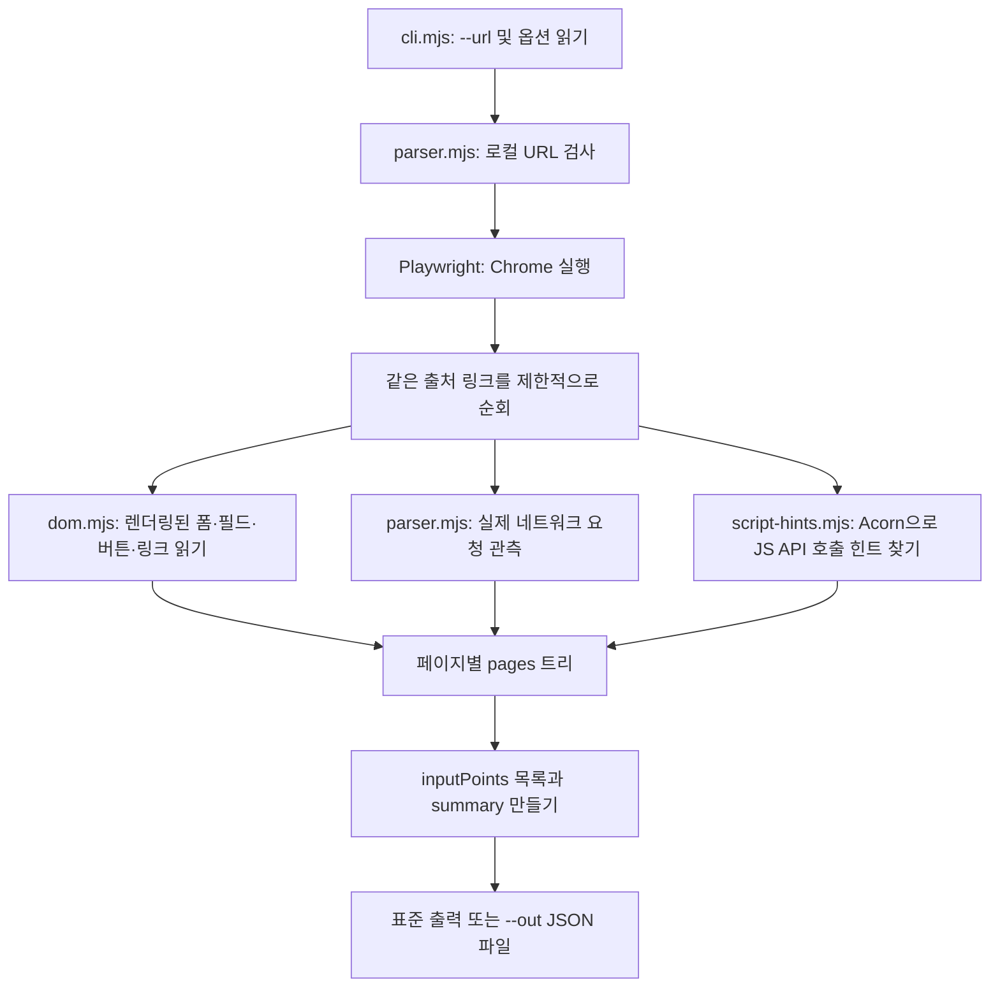

# xss-parser: 로컬 웹사이트 입력 지점 → JSON

이 도구는 **실행 중인 로컬 웹사이트의 URL**을 받아, 사람이 값을 넣거나 조작할 수 있는 지점을 JSON으로 정리합니다. 게시판 글쓰기, 댓글, 검색, 로그인, 파일 선택, 드롭다운, 숨은 폼 필드, URL 쿼리·해시 등을 같은 방식으로 기록하는 것이 목표입니다. 결과는 이후 AI가 살펴볼 **사이트 지도**이며, 취약점 판정이나 공격 결과가 아닙니다. 기존 `xss-fuzzer`와 별도의 프로그램입니다.

현재 출력 형식은 **초안 v1**입니다. 사이트별 사용 결과를 보며 키를 바꿀 수 있도록 `schemaVersion`을 넣었습니다. JSON은 `pages`에 페이지별 트리로 담고, `inputPoints`에 입력 지점의 짧은 목록과 트리 위치(`ref`)를 한 번 더 담습니다. AI는 목록에서 관심 지점을 찾은 뒤 `ref`가 가리키는 상세 정보와 근거를 읽을 수 있습니다.

## 설치와 실행

Node.js 20 이상과 Chrome 또는 Chromium이 필요합니다. macOS에 Chrome이 설치되어 있으면 자동으로 사용합니다.

이 폴더에 복사된 `vul-web-1/` 게시판을 먼저 켭니다. 터미널을 두 개 열어 각각 저장소 최상위 폴더에 서 실행하세요.

터미널 1 — 게시판 서버(계속 켜둡니다):

```sh
cd xss-parser
npm install
npm start
```

터미널 2 — 파서 실행:

```sh
cd xss-parser
npm run parse -- --url http://127.0.0.1:3000/ --out report.json
```

`report.json`은 두 번째 터미널의 현재 폴더에 만들어집니다. 같은 이름의 파일이 있으면 덮어쓰며, Git에는 포함되지 않습니다. `--out`을 생략하면 JSON이 터미널에만 출력됩니다. Chrome이 없다면 `npx playwright install chromium`을 실행할 수 있습니다.

Chrome 창을 보면서 첫 페이지만 읽으려면 다음처럼 실행합니다. 창은 파싱이 끝나면 닫힙니다.

```sh
npm run parse -- --url http://127.0.0.1:3000/ --headed --max-pages 1 --wait-ms 2000 --out report.json
```

여기서 `--max-pages 1`은 첫 페이지만 읽고, `--wait-ms 2000`은 화면이 뜬 뒤 2초 기다린다는 뜻입니다. 파서 자체를 검증하려면 별도의 로컬 시험 서버를 사용하는 `npm test`를 실행합니다.

## 입력과 명령어 옵션

**필수 입력은 로컬 URL 하나**입니다. `localhost`, `127.0.0.1`, `[::1]`의 HTTP(S) 주소만 받습니다. 예: `http://127.0.0.1:3000/`. URL에 이미 쿼리나 해시가 있다면 이름을 기록하지만 값은 JSON에서 가립니다.

| 옵션 | 필수 여부 | 뜻 |
| --- | --- | --- |
| `--url URL` | 필수 | 첫 페이지의 로컬 주소 |
| `--out FILE` | 선택 | 결과 JSON 파일. 생략 시 표준 출력 |
| `--max-pages N` | 선택 | 같은 출처의 링크를 따라갈 최대 페이지 수. 기본 10, 범위 1~30 |
| `--wait-ms N` | 선택 | 각 페이지가 뜬 뒤 JavaScript 화면 갱신을 기다릴 시간. 기본 500ms, 범위 0~5000 |
| `--timeout-ms N` | 선택 | 페이지 이동 제한 시간. 기본 10000ms, 범위 1000~30000 |
| `--browser FILE` | 선택 | Chrome/Chromium 실행 파일 경로를 직접 지정 |
| `--headed` | 선택 | Chrome 창을 화면에 표시. 기본은 창이 안 보이는 실행 |
| `--help`, `-h` | 선택 | 도움말 출력 |

`--headed`만 값 없이 쓰는 스위치입니다. 나머지 옵션은 뒤에 값이 옵니다. `npm start`는 복사된 게시판 서버를 켜고, `npm run parse -- --url ...`은 파서를 실행합니다. 가운데 `--`는 뒤의 옵션을 `cli.mjs`에 전달한다는 뜻입니다.

## 무엇을 읽는가

1. Playwright가 로컬 주소를 Chrome에서 열고, 같은 출처의 일반 링크를 최대 `--max-pages`만큼 따라갑니다. 삭제·로그아웃처럼 보이는 링크는 이동 대상에서 제외합니다.
2. 렌더링된 DOM에서 `form`, `input`, `textarea`, `select`, `contenteditable`, 일부 ARIA 입력 역할과 버튼을 읽습니다. JavaScript가 만들어 놓은 입력창도 대기 시간 안에 나타나면 포함됩니다.
3. 현재 URL, 같은 출처 링크, 실제 네트워크 요청, JavaScript 코드의 API 힌트에서 **쿼리 매개변수 이름**을 모읍니다. URL 경로의 숫자·UUID·긴 토큰 모양도 별도 힌트로 표시합니다.
4. 화면을 여는 동안 브라우저가 시도한 요청의 메서드·경로·응답 상태·쿼리 키·본문의 최상위 키를 기록합니다. 차단된 요청은 서버에 도착하지 않으며 응답 상태가 `null`일 수 있습니다. 요청 본문 값과 URL 쿼리 값은 출력하지 않습니다.
5. 읽어 온 외부·인라인 JavaScript를 Acorn으로 파싱해 `fetch('/...')`, `api('/...', {method:'POST', ...})`처럼 주소가 코드에 드러난 호출을 찾습니다. 폼 필드 이름과 JSON 본문 키가 같으면 연결 **가능성**을 표시합니다. 이 힌트는 실행을 관측한 요청과 구분합니다.

폼을 제출하거나 버튼을 누르지 않습니다. POST·PUT·PATCH·DELETE 같은 쓰기 요청은 페이지 JavaScript가 자동으로 만들더라도 브라우저 단계에서 차단합니다. 외부 인터넷 주소 요청도 차단하며, 같은 컴퓨터의 다른 로컬 포트로 가는 읽기 요청은 허용합니다. 화면의 GET 링크는 방문할 수 있으므로, 실습용 복제 사이트에서 사용하는 편이 좋습니다.

## JSON 구조와 각 키의 의미

아래는 주요 키만 남긴 축약 예시입니다. 실제 결과에는 이보다 많은 키와 항목이 들어갑니다.

```json
{
  "schemaVersion": "1.0",
  "tool": "xss-parser",
  "target": { "startUrl": "http://127.0.0.1:3000/", "origin": "http://127.0.0.1:3000" },
  "summary": { "pagesVisited": 1, "formsFound": 1, "fieldsFound": 2 },
  "pages": [
    {
      "id": "page-1",
      "url": "http://127.0.0.1:3000/",
      "forms": [
        {
          "id": "page-1-form-1",
          "submission": {
            "htmlDefault": { "method": "GET", "actionUrl": "http://127.0.0.1:3000/" },
            "actualSubmissionObserved": false,
            "possibleScriptEndpointHints": [
              { "hintId": "page-1-script-hint-5", "matchedFieldNames": ["title", "content"] }
            ]
          },
          "fields": [
            { "id": "page-1-field-1", "name": "title", "type": "text", "selector": "#post-title" },
            { "id": "page-1-field-2", "name": "content", "type": "textarea", "selector": "#post-content" }
          ]
        }
      ],
      "scriptEndpointHints": [
        { "id": "page-1-script-hint-5", "declaredMethod": "POST",
          "endpointUrlTemplate": "http://127.0.0.1:3000/api/posts",
          "bodyKeys": ["title", "content"] }
      ]
    }
  ],
  "inputPoints": [
    { "id": "page-1-field-1", "kind": "dom-field",
      "ref": "/pages/0/forms/0/fields/0", "name": "title", "selector": "#post-title" },
    { "id": "page-1-field-2", "kind": "dom-field",
      "ref": "/pages/0/forms/0/fields/1", "name": "content", "selector": "#post-content" }
  ]
}
```

| 최상위 키 | 의미 |
| --- | --- |
| `schemaVersion`, `tool` | 출력 형식 버전과 생성 프로그램 |
| `target` | 시작 URL, 출처(origin), 탐색 범위. URL 값은 가린 형태 |
| `scan` | 읽기 중심 실행 설정: 최대 페이지, 대기 시간, 쓰기 요청 차단 여부, 창 표시 여부 |
| `summary` | 방문 페이지·폼·필드·URL 매개변수·버튼·요청·오류 개수와 `truncated` 여부. URL 쿼리는 실제 관측(`urlQueryParametersObserved`)과 정적 힌트만 있는 경우(`urlQueryParametersStaticOnly`)도 따로 셈 |
| `pages` | 방문 페이지별 상세 트리. 페이지 하나에 폼, 독립 필드, 버튼, URL 입력, 링크, 요청, JS 힌트를 모음 |
| `inputPoints` | AI가 빠르게 훑을 입력 지점 목록. `ref`는 상세 항목의 JSON Pointer 경로 |
| `blockedRequests` | 범위 밖 요청 또는 POST 등 차단한 요청과 이유 |
| `limitations` | 이 실행 결과를 해석할 때의 한계 |

| `pages[]` 내부 키 | 의미 |
| --- | --- |
| `id`, `url`, `title`, `status` | 페이지 식별자, 값이 가려진 URL, 제목, 최초 문서 HTTP 상태 |
| `path` | 경로와 세그먼트의 모양. `possibleVariable`은 숫자·UUID·긴 토큰 모양의 **추정** |
| `forms` | 폼 목록. 각각 `fields`와 `controlIds`를 가짐 |
| `standaloneFields` | 폼 바깥에 있는 입력 요소 |
| `controls` | 제출·새로고침·계정 변경 등에 쓰이는 버튼과 위치. 파서는 누르지 않음 |
| `urlInputs.queryParameters` | 쿼리 이름과 발견 출처: `current-url`, `link`, `network-request`, `static-js-hint` |
| `urlInputs.fragment` | URL 해시가 현재 주소나 링크에서 실제로 보였는지 |
| `links` | 같은 출처 링크. `crawlEligible:false`면 이동을 생략한 이유가 붙음 |
| `observedRequests` | 브라우저가 시도한 요청. `method`, 가린 `url`, `resourceType`, `queryParameters`, `bodyKeys`, `status`를 기록함. 차단되거나 실패한 요청은 `status`가 `null`일 수 있으며 차단 사유는 `blockedRequests`에 있음 |
| `scriptEndpointHints` | Acorn이 JS 코드에서 찾은 API 호출 모양. `declaredMethod`, 주소 템플릿, 본문 키, 파일·줄 번호. **실제 호출 증거는 아님** |
| `scriptAnalysisErrors`, `errors` | JS 구문 분석 오류와 페이지 실행/이동 오류 |
| `counts.truncated` | 페이지가 너무 커서 일부 요소 목록이 잘렸는지 |

| 필드·폼 키 | 의미 |
| --- | --- |
| `id`, `selector` | 결과 안의 ID와 화면에서 요소를 찾는 CSS 선택자 |
| `name`, `htmlId`, `label`, `placeholder` | HTML 속성과 화면에 보이는 이름. 없으면 `null` |
| `tag`, `type` | `input`/`textarea`/`select`/사용자 정의 입력과 세부 종류. `password`, `search`, `file` 등 포함 |
| `required`, `disabled`, `readOnly`, `visible`, `userEditable` | 필수·비활성·읽기 전용·화면 표시·직접 수정 가능 상태. 숨은 필드는 기록하되 직접 수정 가능으로 표시하지 않음 |
| `constraints`, `options` | 길이, 패턴, 최소·최대, 파일 종류, 자동완성, `select` 선택지 등 |
| `submission.htmlDefault` | HTML 속성 기준의 기본 전송 방식. JS가 가로채면 실제 요청과 다를 수 있음 |
| `submission.actualSubmissionObserved` | 폼을 실제 제출해 관측했는지. 현 버전은 항상 `false` |
| `submission.possibleScriptEndpointHints` | 폼 필드 이름과 JS 요청 본문 키가 겹친 힌트. **연결 확인이 아닌 이름 비교** |

`ref: "/pages/0/forms/0/fields/1"`은 첫 번째 페이지의 첫 번째 폼에 있는 두 번째 필드를 가리킵니다. 경로의 숫자는 0부터 셉니다. `summary.scriptEndpointHints`는 JS에서 찾은 호출 **위치**의 수로, 서로 다른 API 주소의 수가 아닙니다.

`inputPoints[].kind`는 `dom-field`, `url-query`, `url-fragment`, `url-path-segment` 중 하나입니다. 경로 세그먼트는 숫자·UUID·긴 토큰처럼 변수로 보일 때만 목록에 추가하는 **모양 기반 추정**입니다. `evidence`가 DOM인지, 링크인지, 실제 요청인지, 정적 JS 힌트인지 구분해야 합니다. `candidate`, `confirmed`처럼 취약점 판정을 암시하는 키는 이 파서에서 쓰지 않습니다.

실습 게시판에서는 제목 `title`과 본문 `content`가 DOM 필드로 잡힙니다. HTML 폼의 기본 메서드는 GET이지만, JS에는 `POST /api/posts`와 `{title, content}`가 나타납니다. 출력은 이 차이를 각각 `htmlDefault`와 `scriptEndpointHints`에 기록합니다. 본문 XSS가 실제로 가능한지는 이 파서가 판정하지 않습니다.

## 코드 흐름



- `cli.mjs`: 사람이 입력한 명령어를 분해하고 JSON을 출력합니다.
- `parser.mjs`: 브라우저 실행, 범위 제한, 링크 순회, 요청 기록, 결과 조립을 맡습니다.
- `dom.mjs`: 브라우저 화면 안에서 실제 HTML 요소를 읽습니다.
- `script-hints.mjs`: 읽어 온 JavaScript의 API 호출 **형태**만 분석합니다.
- `test/parser.test.mjs`: 검색·폼·숨은 필드·동적 입력창·차단된 POST를 가진 작은 로컬 사이트로 동작을 검증합니다.
